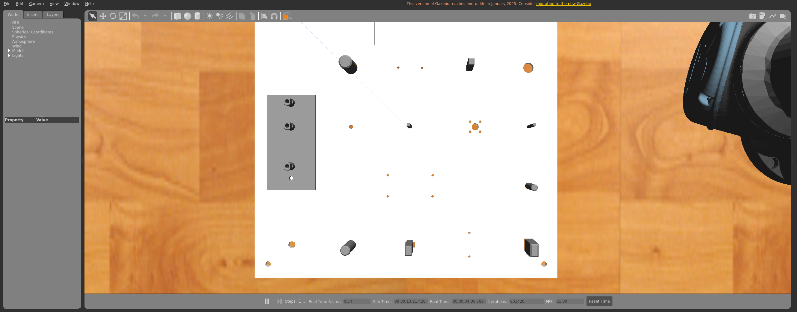
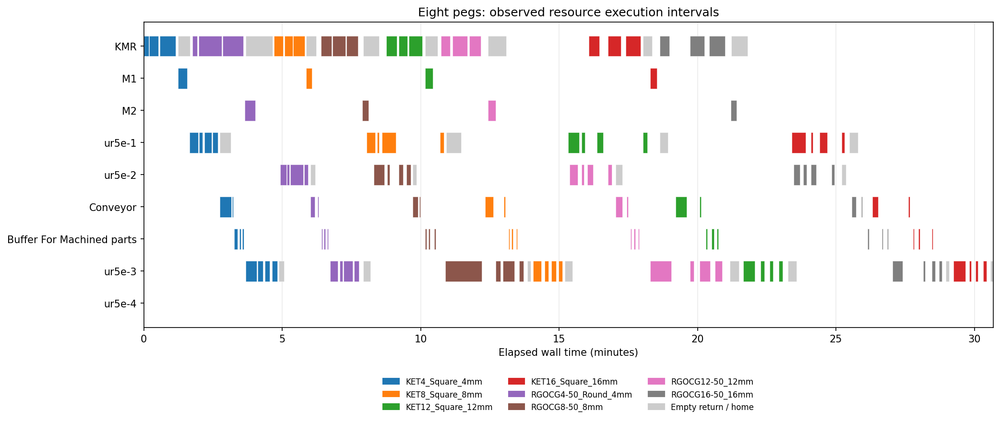

# Eight-peg live validation

Completed on 2026-09-23. Run `a386bc59bfbc4a93bb804a15f75fc498`.

## Result

All eight Storage pegs completed negotiated production and observed insertion/release into their correct assembly slots. All five robots are empty and home. KMR is idle at Storage with its gripper open and downward-facing. Conveyor, buffer, machine workholding, staging areas, reservations, and pending work are clear. Visible Gazebo remains running with the completed scene; owned production workers have exited.

The intake scheduler selects one new peg for route discovery. Admitted parts and resource home requirements negotiate independently. The real-inbox regression confirms one active Storage route discovery. This live run admitted pegs in the order below and had at most **4 admitted, unfinished pegs**. CCA approved all 164 acknowledged capability events through 146 approval batches. There is no additional fixture mutual-exclusion lock; fixture observation/registration runs once during ordered startup.

| Intake identity | Offered machine | Final state |
|---|---|---|
| KET4_Square_4mm | M1 | assembled |
| RGOCG4-50_Round_4mm | M2 | assembled |
| KET8_Square_8mm | M1 | assembled |
| RGOCG8-50_8mm | M2 | assembled |
| KET12_Square_12mm | M1 | assembled |
| RGOCG12-50_12mm | M2 | assembled |
| KET16_Square_16mm | M1 | assembled |
| RGOCG16-50_16mm | M2 | assembled |

M1 used square trimming with ur5e-1; M2 used circle trimming with ur5e-2. Both lanes used Conveyor → Buffer For Machined parts → ur5e-3 → assembly_board-v1. ur5e-4 remained home. The existing full order and one-part M1 demonstration remain available. Machining durations remain configured simulation durations; machining acknowledges a trim result without reshaping CAD geometry.

## Physical and protocol evidence

- [Completed trace](completed_run.json.gz): requests, offers, selections, rejection/waiting reasons, CCA approvals, acknowledgements, function timing, and internal primitive results.
- [Trace validation](trace_validation.json): all 164 completion validators passed; exact machine/conveyor/buffer primitive compositions and all eight routes checked.
- [Final Gazebo observations](final_observations.json): all eight slot positions within 2 mm and upright within 0.02 rad; all five home postures within 0.02 rad; open grippers; no attached payload collision objects. Maximum observed home joint error was 0.004343 rad.
- [Home and custody validation](home_and_custody_validation.json): 24 home returns after handling cycles, 16 observed UR grasps, no next pickup before the owner's home return, and every upstream robot's return started before its peg was assembled. KMR returned empty eight times.
- `environment_145` moved both 16 mm pegs by the shared conveyor displacement. Individual primitive completion did not acknowledge its capability event.
- [Cleanup validation](cleanup_validation.json): no owned worker processes remain.
- [Source fingerprints](source_sha256.json) identify the implementation/configuration used.

[Completed cell with all robots home](final_cell.png)

## Measured timing

Makespan starts at the first productive function and ends at the last home function completion. Function intervals include their own planning and observation work. They are separate from sampled physical movement.

| Measurement | Observed value |
|---|---:|
| Makespan, wall time | 1840.48 s (30 min 40 s) |
| Simulation elapsed during production | 710.42 s |
| Simulation / wall time | 0.386× |
| Throughput for this eight-peg run | 15.65 parts / wall hour |
| Overlap of productive functions on different pegs | 554.81 wall s |
| Sampled simultaneous productive robot movement | 103.86 wall s, 496 samples |
| Negotiation elapsed, median / maximum | 1.55 / 42.75 s |
| Dispatch to execution, median / maximum | 2.56 / 13.39 s |
| Execution completion to acknowledgement, median / maximum | 0.048 / 2.83 s |
| Cycle completion to home start, median / maximum | 8.12 / 27.47 s |
| Start System preparation / agent readiness, Gazebo already available | 30.25 s |

The run recorded 276 discoveries/revalidations, including 155 retained-candidate requests. Their elapsed durations sum to 920.43 s. Resource motion planning/checking durations sum to 544.98 s. These sums span concurrent work and must not be added to makespan. Maximum recorded requirement wait was 1115.79 s, including queued Storage intake.

Physical movement was sampled from joint/base observations at approximately 5 Hz, with a 0.002 rad arm threshold and 1 mm base threshold. Recorded pairs include KMR with ur5e-1, ur5e-2 and ur5e-3, and ur5e-1 with ur5e-2. Sampling uncertainty applies to the 103.86 s movement estimate.

GPU rendering used `D3D12 (NVIDIA GeForce GTX 1650 Ti)`. The run remained slower than real time. Negotiation, shared-resource waiting, and timed trajectory validation also contribute to delays; home returns were scheduled after each robot's cycle, but were not instantaneous. The timeline exposes those idle periods.

[Timing details](timing_summary.json) · [Movement overlap evidence](motion_overlap.json) · [Simulation samples](performance.jsonl.gz) · [Joint/base observations](observed_motion.jsonl.gz) · [Part observations](observed_parts.jsonl.gz)

## Verification and earlier failures

- Latest focused motion, recovery, delivery and insertion suite: **244 passed** — [log](final_motion_tests.log).
- Incremental eight-peg PA–RA/CCA real-inbox test: **passed** — [log](incremental_inbox_test.log).
- KMR docking, runtime URDF/QoS and Stop regression selection: **46 passed** — [log](docking_tests.log).
- Earlier focused capability/model/UI/worker coverage remains in [focused test log](focused_tests.log) and [protocol log](protocol_eight_tests.log), including stale offers, changed availability, transport failures/backpressure and function catalog compatibility.
- `poetry check`, Python compile checks, and `make bootstrap-gazebo` passed — [Poetry](poetry_check.log), [compile](compile.log), [bootstrap](bootstrap.log). Poetry reports existing metadata deprecation warnings.

Earlier failed trials and original reports are preserved in [failed_trials.json](failed_trials.json) and `failed_reports/`. The principal later motion failure was reproduced as a Cartesian joint branch change: a fraction-1.0 timed path contained colliding intermediate motion. Enabled jump checks rejected that path before dispatch. Timed paths are now collision checked; unanswered read-only checks retry within the observation deadline. Failed grasps retain custody and rollback evidence. The local M2 grasp reproduction and this complete run passed without widening position tolerances or bypassing collision checks.
