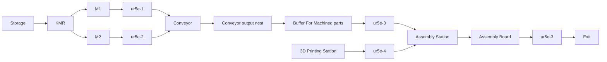

# Recovery framework journal implementation plan

## Purpose and status

This document is the implementation roadmap for `recovery-framework-journal`.
It covers the NIST Products page, the expanded Gazebo environment, and four
recovery experiments. Phase 2 is **complete as of 2026-09-16**: the dashboard
launches a dedicated NIST world, the second implementation replaces xarm6 with UR5e, and
the third implementation adds M1 and M2. The fourth adds the four-UR5e layout,
Storage, passive Conveyor, staging trays, and Buffer For Machined parts. The
fifth compacts that layout, moves the eight pegs into Storage, and adds the
Conveyor output nest, one `3D Printing Station`, and an empty `Exit`. The sixth
adds fitted Storage trays, a recognizable printer with `gear_medium`, and a
spawn-only `KMR` at M1 KMR docking pose. The seventh rotates Storage and the
printer for their assigned handling resources, adds the Conveyor pusher and
four-position indexer handoff, and replaces the generic KMR appearance with a
static KUKA KMR iiwa/LBR iiwa 14 R820/OnRobot RG2 model. The eighth corrects
assembly names (`ur5e-3` top, `ur5e-4` bottom), replaces that handoff with a
straight Conveyor pickup buffer, moves the printer beside `ur5e-4` with all
three gears, and puts the KMR arm upright. The corrected ninth implementation
divides the pickup buffer into four direct-part accumulation zones with a fixed
guide channel. It adds no removable carrier stations or collection tray.
The tenth replaces the centered box-platform approximation with a detailed
static KMP omniMove 400 appearance and offsets the complete upright LBR
iiwa/OnRobot RG2 chain 0.25 m from the platform center. The final orientation
correction rotates the platform clockwise 90° in the world, rotates the complete
arm/adapter/RG2 chain counterclockwise 90° locally, and makes the occupied M1
docking marker vertical. A final docking-placement correction parks `KMR` on
`Storage_KMR_docking_pose`, moves the M1 marker to `(-7.25, 2.30, 0)`, and
moves and rotates the M2 marker to `(-3.85, 2.30, 0, 0, 0,
-1.57079632679)`. Later work remains **planned**;
source changes, verification, and observed results are recorded separately.

Phase 1 — NIST Products is also **complete as of 2026-09-16** for the fixed
eleven-component catalog, recovery manifest/order/geometry, Products-page table,
and exact subset-order persistence. This status does not establish resource
execution, reachability, or assembly success.

The first implementation is complete for scene selection and removal of the
old mocked world. Source checks and a live Gazebo scene inspection passed on
2026-09-15. The second implementation is complete for the two-UR5e Gazebo/MoveIt
environment, with independent simulated motion verified on the same date;
the third implementation is complete for loading the two Haas Mini Mill
machines and their interaction locations. The final docking-placement
correction closes the static Phase 2 layout. World geometry,
station placement, initial inventory,
four UR5e bindings, and parked `KMR` now form the accepted baseline. Motion,
reachability, resource execution, transport, perception, and recovery success
were unverified at that boundary. The first Phase 3 implementation now adds
simulation control for the KMR base, arm, and gripper without changing the
accepted station geometry.

Implement one phase at a time. Update its status only with the changed paths,
verification commands, results, and saved execution evidence. An accepted
recovery proposal does not establish successful execution or assembly.

## Current focus: collision-aware KMR navigation and reach validation

The known NIST Products increment is complete. The recovery framework's eleven
loose NIST components form a fixed, configuration-known catalog. Individual
recovery orders can select any valid subset. Product identity, CAD/model
bindings, source resource, and assembly target come from recovery configuration,
with no Spec2Primitives recognition dependency. Phase 3 begins with KMR
simulation control, recovery-specific RViz state, deterministic Storage–M1/M2
docking, and collision-aware arbitrary base targets. The next increment adds
station collision geometry to MoveIt and validates manipulation reach before
machine interaction.

## First Phase 3 implementation: KMR control and RViz integration

The accepted [recovery world][recovery-world] remains the static layout source.
At launch, [recovery_framework_gazebo.launch.py][recovery-launch] removes its
single static `KMR` include from a temporary runtime-world copy and spawns one
articulated `KMR` at the configured Storage pose. The source world and its
accepted station placement are unchanged.

The runtime KMR model contains a dynamic 400 kg KMP omniMove 400 base, seven
LBR iiwa joints, and one `KMR_rg2_finger_width` joint. The arm retains mount
`(-0.25, 0, 0.70)`, local yaw `1.57079632679`, and upright initial joint state.
Its two trajectory controllers and namespaced joint-state broadcaster are
separate from the four-UR5e controller manager. The planar Gazebo plugin uses
`/KMR/cmd_vel` and `/KMR/odom` with `world` and `KMR_base_link` as its odometry
frames.

`/KMR/dock` accepts only `Storage`, M1, and M2. The Storage–M1 route follows the
direct configured aisle; Storage–M2 follows the northern aisle around M1. The
route table is reversible, while direct M1-to-M2 motion is rejected. The action
requires fresh odometry and an upright arm/open RG2 state. Cancellation, stale
odometry, route-state errors, loss of the parked arm state, no progress, and
waypoint timeout publish zero velocity and fail closed. ResourceAgent binding
remains disabled through `integrated: false`; the separate
`simulation_control_integrated: true` field records this simulation capability.

The combined MoveIt model includes state-only KMR world-x, world-y, and yaw
joints sourced from odometry; MoveIt does not control those base joints.
`KMR_iiwa_arm` and `KMR_rg2_gripper` are available separately. `all_robots`
contains the four UR5e arm groups plus `KMR_iiwa_arm`, for 31 arm joints.
The recovery-specific SRDF and OMPL configuration contain no `dual_robots`
group. Historical and hardware launch configurations remain unchanged.
Grippers and the KMR base remain outside `all_robots`.

The recovery RViz configuration selects `all_robots`.
[recovery_drag_markers.py][recovery-markers] waits for all 36 controlled joint
states plus KMR odometry before creating five orange six-axis arm targets at
current TCP transforms and a blue KMR base menu at its current pose. RViz is
started from that readiness event, allowing its five built-in orange MoveIt
goal models to initialize from the same live state instead of default poses.
Targets remain staged while planning and resynchronize after successful
execution or an explicit reset. The base menu exposes only Storage, M1, M2,
and Cancel.

## Second Phase 3 implementation: faster arms and collision-aware KMR navigation

Recovery MoveIt requests and RViz use 0.4 velocity and 0.3 acceleration scaling
for all five arm groups without changing joint limits. `all_robots` remains the
31-joint combined arm group.

The KMR base uses a recovery-specific 0.05 m occupancy map in `world`, covering
approximately `x=-10.5…1.5` and `y=-1.5…4.8`. It marks Storage, M1, M2,
Conveyor, Buffer For Machined parts, Assembly Station, tables, pedestals, and
fixed robot workspaces. `SmacPlanner2D` plans paths and holonomic DWB follows
them with the `1.19 × 0.72 m` KMR footprint, 0.03 m padding, 0.80 m/s maximum
translation, and 0.35 rad/s maximum rotation. Gazebo odometry supplies the
exact base pose; this increment does not use AMCL, SLAM, or live obstacle
sensors.

The blue `KMR_base` marker can be dragged in x/y and rotated to stage an
arbitrary target. Its menu provides planning, execution, plan and execute,
reset, the three named docking commands, and cancellation. Dragging never
publishes velocity. Fixed-obstacle and out-of-map targets are rejected during
planning. `/KMR/dock` preserves Storage–M1/M2 route rules and allows return to
Storage from an arbitrary reachable pose. Named docks follow every configured,
map-validated route segment with a deterministic holonomic controller that
holds the requested yaw. It uses up to 0.80 m/s on the route and 0.30 m/s for
the last 0.30 m. A 0.40 m/s² command ramp avoids abrupt velocity changes in
the articulated KMR simulation. Return from an arbitrary pose uses Nav2 to reach the Storage
approach before deterministic final docking. This avoids DWB turning or
running recovery maneuvers on the fixed docking routes. DWB's `Twirling` critic
suppresses unnecessary rotation during arbitrary travel, and the recovery
navigation trees fail closed without automatic backup or spin behaviors.

The recovery base controller first moves the KMR iiwa into its upright
transport pose and holds it there while the base travels. Gravity is disabled
and the KMP root, iiwa, and RG2 links are kinematic in this recovery-only
simulation model so inertial impulses from the planar base plugin cannot trip
the parked-arm gate. The commanded joints remain available through
`ros2_control`. Dynamic wheel-force, payload, and joint-torque fidelity remain
later validation work.

Nav2 publishes `/KMR/nav_cmd_vel`; a dedicated gate forwards bounded commands
to `/KMR/cmd_vel` only with fresh odometry, a fresh Nav2 command, active
navigation, and the iiwa/RG2 parked state. Cancellation or a failed gate
publishes zero velocity. Dynamically generated machine recovery poses, live
obstacle sensing, KMR unloading, and Conveyor placement remain later work.

Phase 3 motion validation moved `Storage_KMR_docking_pose` and the initial KMR
pose 0.10 m east, from `x=-8.25` to `x=-8.15`. The earlier pose left only about
10 mm between the 0.03 m padded Nav2 footprint and Storage after map
discretization, and repeated collision-aware docking stopped short. The
corrected pose retains the Storage-side dock and provides approximately 0.11 m
of padded map clearance. Historical Phase 2 verification records below remain
unchanged.

**Boundary:** this implementation establishes simulation control and
visualization. Station collision geometry, machine manipulation, ResourceAgent
execution, Conveyor/buffer transport, and recovery success remain unverified.

## Third Phase 3 implementation: faster KMR navigation and clearer RViz controls

KMR starts at `Storage`. The named nominal routes remain exactly Storage–M1
and Storage–M2, so **Dock at M2** from M1 remains rejected. Manual navigation
may reach a nearby collision-free pose, but it does not establish semantic
docking, machine availability, or manipulation readiness.

The simulation translation limit is `1.20 m/s`, with `1.00 m/s²` acceleration
and deceleration. Rotation is limited to `0.50 rad/s`, with `1.00 rad/s²`
angular acceleration and deceleration. Named docking uses `0.40 m/s` only
within the final `0.20 m` and retains the strict `0.03 m` position and
`0.035 rad` yaw tolerances. These limits are identical in DWB and the base
command gate. The translation limit intentionally exceeds the approximately
`0.83 m/s` straight and `0.56 m/s` crosswise KMP omniMove 400 limits reported
by the [KUKA product presentation][kmr-product-presentation]. It is a simulation
speed override and cannot support physical KMR cycle-time claims.

Recovery RViz includes the standard **Nav2 Goal** arrow. Clicking a clear floor
position and dragging the arrow sets an immediate plan-and-execute request via
RViz's native `/navigate_to_pose` endpoint. That endpoint and the explicit
`/KMR/validated_navigate_to_pose` endpoint use the same validation proxy. The
arrow disappears on release because RViz has submitted the request. The proxy forwards to
`/KMR/navigate_to_pose` only with fresh odometry, the iiwa in its parked state,
available Nav2, and no other KMR base action. It relays feedback, result, and
cancellation and publishes zero velocity after cancellation or failure. RViz
shows the resulting `/KMR/plan` path.

The **Navigation 2** panel receives the **Nav2 Goal** tool's submitted pose and
sends the action request. The blue marker's visible pad is an x/y
`MOVE_PLANE` control; its right-click menu remains attached to the same marker,
and its ring sets yaw. The operator selects RViz's **Interact** tool before
dragging it. **Publish Point** is not used because it cannot express the
required final orientation. The duplicate combined `RobotModel` rendering is
disabled and RViz uses 15 FPS while the MoveIt scene remains enabled.

The blue `KMR_base` marker remains the reviewed workflow: drag it to stage a
target, then choose Plan, Execute, or Plan+Execute. Its stored path remains on
`/KMR/planned_path`, and execution passes through
`/KMR/validated_follow_path`. Plan and Plan+Execute capture the destination from
the marker menu event, and execution compares the current base pose with the
saved plan-start pose rather than Nav2's path-heading rewrite. **Cancel KMR
base motion** cancels either RViz workflow through
`/KMR/cancel_base_motion`. The controller reserves one base action slot across
named docking, immediate Nav2 Goal navigation, and reviewed path execution.

A future machining-breakdown recovery event may request direct M1-to-M2
travel. It must remain outside `predefined_routes` until a recovery adapter
generates the northern-aisle candidate and validates Nav2 path clearance, the
parked iiwa state, M2 availability, final docking tolerance, and later MoveIt
manipulation. The LLM selects the recovery intent and configured references; it
does not publish raw coordinates or `/KMR/cmd_vel`.

## Completed Phase 2: Gazebo environment

**Phase 2 — Gazebo layout** used the existing NIST world and CAD assets as its
starting point. The implementations below are retained as the completed layout
record.

The completed implementations are retained in this order:

1. **First implementation:** launch [table_recovery_framework.world][recovery-world]
   from the dashboard's **Start Dual Gazebo + RViz**. Start with the existing
   NIST scene, including three gear types, eight peg types, and the board/gear
   fixtures. Retain the current xarm6 and UR5e during this step.
2. **Second implementation (complete, before renaming):** replace xarm6 with UR5e. Launch `ur5e-2` at the
   existing UR5e position and `ur5e-3` at the former xarm6 position, with
   independent arm/gripper controllers and MoveIt groups. The fourth implementation
   renames that assembly `ur5e-2` to `ur5e-4` and adds `ur5e-1` and `ur5e-2`
   for machine handling with distinct bindings.
3. **Third implementation (complete):** add M1 and M2 as two Haas Mini Mill 3-axis vertical
   CNC milling machines. Give each machine a front access location for
   robot handling, a side access location for KMR, a workholding location, and a
   separate KMR docking pose.
4. **Fourth implementation (complete, superseded placement):** apply [MACHINING_STATION_LAYOUT.md](MACHINING_STATION_LAYOUT.md).
   `ur5e-1` is at M1 and `ur5e-2` at M2; `ur5e-3` and `ur5e-4` are at Assembly
   Station. M1/M2 are farther left, with a 3 m horizontal gap from M2's enclosure
   to the assembly table. Storage, local staging trays, one straight passive
   Conveyor, and Buffer For Machined parts are present. KMR is not spawned; its
   manifest contains only Storage–M1/M2 predefined route endpoints.
5. **Fifth implementation (complete):** compact the complete cell to
   approximately `x=-9.8` through `x=0.8`, leave a 1 m horizontal gap between
   M2 and Assembly Station, move all eight pegs into Storage, retain only
   `prusa_mk4_2` as the initially empty `3D Printing Station`, and add Conveyor
   output nest and an empty `Exit`.
6. **Sixth implementation (complete):** put the eight stored pegs in fitted
   four-position kitting trays, replace the machine-side tables with compact
   capacity-one staging nests, represent `prusa_mk4_2` as an FDM printer with
   the selected `gear_medium`, and park a spawn-only `KMR` at M1 KMR docking
   pose. Assign `ur5e-4` to the Conveyor-output, buffer, and Exit contracts.
7. **Seventh implementation (complete, superseded handoff):** rotate Storage counterclockwise and
   move its KMR dock to the east side; rotate and move `prusa_mk4_2` and `Exit`
   into `ur5e-4`'s local area; add static `Conveyor output pusher` and the
   four-position Buffer For Machined parts indexer; render `KMR` as a KUKA KMR
   iiwa with LBR iiwa 14 R820 and open OnRobot RG2. Keep every new resource
   non-actuated in this layout-and-contract increment.
8. **Eighth implementation (complete):** correct the assembly robot placement
   bindings, replace the rotary handoff with a straight four-position pickup
   buffer for `ur5e-3`, put all three gears on the printer beside `ur5e-4`, and
   show KMR upright. Keep resource motion pending.
9. **Ninth implementation (complete for layout and contracts):** retain the same buffer footprint and
   divide it into four independently represented direct-part belt zones. Add a
   fixed shallow guide channel and tapered infeed for horizontal pegs. Do not
   add removable carriers, carrier supply stands, or a collection tray.
10. **Tenth implementation (complete for static layout):** replace the simplified
   centered-arm KMR appearance with a detailed KMP omniMove 400 representation.
   Keep `KMR` static, offset the upright LBR iiwa and open OnRobot RG2 0.25 m
   toward Storage, and retain the existing poses and Storage–M1/M2 routes.
11. **Final docking-placement correction (complete):** park `KMR` on
   `Storage_KMR_docking_pose`; retain its clockwise yaw and the corrected arm
   transform. Move the vertical M1 and M2 markers 0.40 m toward their machine
   side-access faces, leaving approximately 40 mm enclosure clearance.
12. **Phase 2 closure:** accept the corrected static layout as the baseline. Reopen
   the layout only when later measured reach or collision evidence requires a
   concrete correction.

Machine processing, printing behavior, Conveyor transport, KMR task execution,
MoveIt reach validation, and recovery experiments follow after the known NIST
Products increment. Keep the existing phase identifiers; the table and sections
below show the revised implementation order.

### First implementation: recovery framework Gazebo world

The [recovery framework world][recovery-world] starts as a copy of
[table_spec2primitives.world][nist-world]. Component identifiers, CAD references,
dimensions, poses, fixture relationships, cameras, and plugins are preserved.
The old `table.world` and its inline mocked board and pegs are removed. The
dedicated Spec2Primitives world remains available.

The [ROS2 process commands][ros2-processes] route `gazebo_dual` to
`world_file:=table_recovery_framework.world` with both assembly and loose parts
enabled. Launch preflight requires the installed recovery framework world and
reports `make bootstrap-gazebo` if it is missing. The dedicated
`gazebo_dual_spec2primitives` route continues to select its own world.
`SystemBridge` remains the public UI-to-runtime surface. Its approved reset
update reads all eleven NIST components, including gear `<include>` entries.

The [Gazebo launch][dual-launch] applies the existing NIST gripper follower and
startup-position settings to the new filename. Passive filtering recognizes
the NIST components and fixtures; automatic attachment reads the selected world
instead of using mocked fallback poses. Product geometry lookup and robot mesh
lookup default to the recovery framework world. Bootstrap removes the stale
installed `table.world`, and setup documentation uses the new default.
This step changes the Gazebo scene selected
from the dashboard; Products-page integration, robot replacement, and additional
resources remain planned.

Verification for this first implementation is recorded below. It does not
establish the completed expanded layout, production, or recovery experiments.

### Second implementation: replace xarm6 with UR5e (historical bindings)

The names and two-robot configuration in this subsection describe that increment.
The four-UR5e implementations below supersede these deployment bindings.

The dashboard's existing `gazebo_dual` route selects
[recovery_framework_gazebo.launch.py][recovery-launch] when
`world_file:=table_recovery_framework.world`. It builds two UR5e/RG2 chains in
the `dual_robot` Gazebo entity through one `GazeboSystem`. Both share `/controller_manager` and
`/joint_states`; each arm and gripper has its own controller and prefixed
joint/frame names. Gazebo and MoveIt receive the same robot description.

[recovery_framework_gazebo.json][recovery-robots] supplies the exact resource
identifiers, prefixes, initial joints, and base poses. It is installed under
`cais_lab_robotics/config`. `ur5e-3` faces toward the board from the opposite
side. The two existing NIST tables and all part/fixture identifiers stay intact.

| Resource | Base position (m) | Arm planning group | Gripper planning group |
| --- | --- | --- | --- |
| `ur5e-2` | `(0.0, 0.5, 1.021)` | `ur5e_2_ur_manipulator` | `ur5e_2_rg2_gripper` |
| `ur5e-3` | `(0.0, -0.5, 1.021)` | `ur5e_3_ur_manipulator` | `ur5e_3_rg2_gripper` |

The paired planning group remains `dual_robots`. Controller action paths are
`/ur5e_2_joint_trajectory_controller/follow_joint_trajectory`,
`/ur5e_3_joint_trajectory_controller/follow_joint_trajectory`, and the matching
`ur5e_2_rg2_gripper_traj_controller`/`ur5e_3_rg2_gripper_traj_controller` actions.
TCP frames are `ur5e_2_rg2_gripper_tcp` and `ur5e_3_rg2_gripper_tcp`.

[recovery_framework.rviz][recovery-rviz] exposes these groups. The existing
UR5e/RG2 model builder now accepts instance bindings while keeping its single
UR5e defaults. Both RG2 grippers start open. The world retains `/ATTACHLINK`
and `/DETACHLINK`; the old xarm6 automatic-attachment node is not launched for
this setup. Resource-agent handling/custody integration is Phase 3 work.

This is a Gazebo/MoveIt environment step. Dashboard Robot Functions, legacy
prewarm/reset controller acquisition, and agent production still use the older
resource configuration; they are not validation paths for the new UR5e groups.
Use the named RViz groups for this environment. The existing Spec2Primitives
route and physical robot configurations retain their xarm6 + UR5e bindings.
`SystemBridge` has no further changes in this step.

[recovery environment tests][recovery-environment-tests] cover binding
validation, controller isolation, actual UR5e/RG2 model generation, MoveIt
agreement, collision exclusions, single-UR5e compatibility, and resolution of
the NIST CAD meshes through the launch environment. The Gazebo model search
path includes both the package's `models` directory and its share directory,
which contains `cad_models`. Model-state entries alone do not establish that
these meshes rendered successfully. Verification results are recorded below.

### Third implementation: add M1 and M2

The recovery world includes two instances of the project-owned
[Haas Mini Mill model][haas-mini-mill]. M1 and M2 use the same simplified
machine geometry. The model uses Gazebo box primitives rather than the Haas CAD
download, so no manufacturer CAD is redistributed. Its envelope follows the
[published Mini Mill layout][haas-mini-mill-layout] closely enough for initial
station arrangement; it is not a metrology-grade machine model.

The model separates collision geometry around the front door and
[automatic side window][haas-side-window]. The two access openings are collision-free and the internal
`workholding` link has table and vise collisions. The `front_access`,
`side_access`, and `workholding` links provide explicit references for later
motion validation. Door movement, spindle behavior, machine interlocks,
processing progress, and material removal remain Phase 3 work.

The current M1/M2 geometry is side by side. Both front doors face the space
reserved for local handling and Conveyor. The blue floor footprints mark the
configured `M1_KMR_docking_pose` and `M2_KMR_docking_pose`; they do not establish
KMR reach. The revised [M1/M2 layout](MACHINING_STATION_LAYOUT.md) places
`ur5e-1` at M1 and `ur5e-2` at M2 for front handling, with KMR using the side
openings. The fourth implementation below adds their robots and passive fixtures.

The world saves a Gazebo GUI camera looking from the front aisle toward +Y.
This makes M1 and M2 appear horizontally on the left, with Assembly Station
to the right, when Gazebo opens. The four perception camera poses stay unchanged.

The current workholding locations are 3.4 m apart. One fixed UR5e cannot reach
both with its [850 mm reach][ur5e-reach]; horizontal alignment alone does not
resolve this. The revised proposal gives each machine its own fixed UR5e,
with KMR transporting WIP between them. Each local handling path and all KMR
access still need validation. The saved camera corrected the opening view;
the fourth implementation below updates this placement. Full handling validation
and KMR integration remain pending.

| Resource | World pose `(x, y, z, roll, pitch, yaw)` | KMR docking pose | Nominal parts |
| --- | --- | --- | --- |
| M1 | `(-8.0, 2.3, 0, 0, 0, -1.57079632679)` | `(-9.65, 2.3, 0, 0, 0, 0)` | `KET4_Square_4mm`, `KET8_Square_8mm`, `KET12_Square_12mm`, `KET16_Square_16mm` |
| M2 | `(-4.6, 2.3, 0, 0, 0, -1.57079632679)` | `(-6.25, 2.3, 0, 0, 0, 0)` | `RGOCG4-50_Round_4mm`, `RGOCG8-50_8mm`, `RGOCG12-50_12mm`, `RGOCG16-50_16mm` |

The installed [recovery framework configuration][recovery-robots] records the
same model, world, access-link, docking, and nominal-part bindings. M1 and M2
may perform off-list work only after the later ResourceAgent validation accepts
the required configuration and its execution succeeds.

### Fourth implementation: four UR5e robots and separated stations

This subsection records the preceding 3 m-gap placement. The fifth
implementation below supersedes these positions while retaining the four-UR5e
controller and MoveIt bindings.

The [world][recovery-world] and [manifest][recovery-robots] now contain the
revised layout. Storage is on the left. M1/M2 are side by side, **3.4 m** apart;
M2's east enclosure edge and the assembly table's west edge have a **3 m
horizontal gap**. The **7.95 × 0.30 m** straight Conveyor spans this gap.
Its support surface is at **1 m**. The Conveyor is static geometry in this
increment, with two marked loading positions and a downstream end stop.

| Resource | Base position (m) | Arm planning group | Gripper planning group |
| --- | --- | --- | --- |
| `ur5e-1` | `(-8.0, 1.1, 0.80)` | `ur5e_1_ur_manipulator` | `ur5e_1_rg2_gripper` |
| `ur5e-2` | `(-4.6, 1.1, 0.80)` | `ur5e_2_ur_manipulator` | `ur5e_2_rg2_gripper` |
| `ur5e-3` | `(0, -0.5, 1.021)` | `ur5e_3_ur_manipulator` | `ur5e_3_rg2_gripper` |
| `ur5e-4` | `(0, 0.5, 1.021)` | `ur5e_4_ur_manipulator` | `ur5e_4_rg2_gripper` |

[recovery_framework_gazebo.launch.py][recovery-launch] now requires four
instances. It builds 28 controlled joints, eight independent arm/gripper
controllers, and one joint-state broadcaster. The existing `dual_robot` entity
and `dual_robots` combined planning group remain. The assembly base poses and
NIST geometry/camera poses are unchanged; the former assembly `ur5e-2` is
`ur5e-4`. Gazebo and RViz opening views cover the expanded layout.

Each machine robot has a pedestal and staging tray. Buffer For Machined parts
is a solid tray on the existing assembly table, with four visual slot markers;
its four slot poses and capacity are recorded in the manifest. No new mocked
products are added. Storage, staging trays, Conveyor, and the buffer have
collision geometry in Gazebo. These world obstacles are **not yet imported
into MoveIt's planning scene**; a valid robot state alone does not establish
collision-free handling in this world.

KMR's manifest contains only the intended Storage–M1 and Storage–M2 route
endpoints and records `integrated: false`. No KMR model, navigation executor,
Conveyor transport, buffer occupancy, processing, or recovery is implemented
by this layout increment. Agent resource/attachment bindings remain Phase 3
work. The station spacing and candidate docking markers require validation
against the actual KMR model before becoming executable routes.

**Next acceptance checks:** add the world obstacles to MoveIt; validate each
complete machine → staging tray → Conveyor path and `ur5e-4`'s end-stop → buffer
path; implement one-part Conveyor transport; then integrate KMR's nominal
Storage/M1/M2 routes. Record geometry, planning, executed motion, and custody
results separately. See the layout document for exact positions.

### Fifth implementation: compact layout and initial inventory

The fifth implementation of the [world][recovery-world] and
[manifest][recovery-robots] placed the
cell approximately within `x=-9.8` through `x=0.8`. Storage is at
`(-9.15, 2.3, 0)`, M1 at `(-6.0, 2.3, 0)`, and M2 at
`(-2.6, 2.3, 0)`. The M2 enclosure has exactly 1 m of horizontal separation
from the assembly table. The straight Conveyor is 6 m long, centred at
`(-3.75, 0.5, 0)`, and has a support surface at `z=1.015`.

The four KET parts start on Storage's upper shelf at `y=2.10`, `z=1.145`.
The four RGOCG parts start at the matching x/y positions on the middle shelf at
`z=0.625`. Their exact identifiers, CAD filenames, and collision geometry are
unchanged. No loose pegs or completed gears start at Assembly Station.
`cam_storage` replaces the obsolete peg-area camera.

`prusa_mk4_2` is the only `3D Printing Station`. It starts empty and records
support for `gear_small`, `gear_medium`, and `gear_large`; later printing
behavior will spawn the requested exact gear model at its output pose. The
Conveyor output nest at `(-0.78, 0.5, 1.015)` and `Exit` at
`(0.4, 0.3, 1.04)` each have capacity one. Buffer For Machined parts retains
four configured slots. `GMC_Laser_Plate_Virtual` and `Gear_Plate` remain static
assembly tooling.

The intended nominal handoff is Conveyor → Conveyor output nest → `ur5e-4` →
Buffer For Machined parts. This increment defines scene geometry, poses, and
capacity only. Conveyor motion, buffer occupancy, printing, Exit transfer, KMR
execution, reach validation, and collision-aware robot motion remain pending.
Gazebo reset discovers the eight stored pegs; printed gears remain outside reset
scope until printing behavior exists.

### Sixth implementation: realistic inventory and parked KMR

The sixth implementation added two fitted four-position kitting trays inside
Storage. The KET part bases are at `z=1.165` on the upper tray and the RGOCG
part bases are at `z=0.645` on the middle tray. The exact eight part identifiers,
CAD meshes, x/y positions, collision geometry, and independent model instances
remain unchanged. Low dividers separate the slots without blocking top pickup.

M1 staging tray and M2 staging tray retain their names and surface centres. Each
is now a compact single-pedestal capacity-one nest instead of a four-legged
table. These nests preserve temporary WIP locations needed by the Conveyor and
machining failure experiments.

The project-owned [prusa_mk4_2 model][recovery-printer] contains static base,
bed, frame, gantry, extruder, nozzle, spool, and display geometry. The current
`assembly_board-v1` order requests `MG`, so one exact `gear_medium` starts at the
printer output pose `(0.4, -0.3, 1.10)`. `gear_small` and `gear_large` remain
supported products without starting in the world. Gazebo reset includes the
completed `gear_medium` along with the eight stored pegs.

The project-owned [KMR model][recovery-kmr] is spawned at
`(-7.65, 2.3, 0, 0, 0, 0)`, occupying M1 KMR docking pose between Storage and
M1. Its static representation provides a `1.08 × 0.63 × 0.70 m` platform,
wheel and safety-scanner visuals, collision geometry, and a parked seven-link
arm based on the [official KMR iiwa dimensional data][kmr-iiwa-dimensions]. It
deliberately has no joints, ROS 2 controller, navigation plugin, or executable
arm. The manifest records `spawned: true`, `integrated: false`, and only the
existing Storage–M1 and Storage–M2 predefined routes.

The manifest assigns `ur5e-4` to Conveyor output nest, Buffer For Machined
parts, and Exit handling. The eventual sequence is Conveyor output nest →
`ur5e-4` → Buffer For Machined parts → Assembly Station, followed by the
completed `assembly_board-v1` → `ur5e-4` → Exit transfer. This increment records
that contract without making the static assembly tooling detachable or issuing
robot commands.

### Seventh implementation: refined handoff and KUKA KMR iiwa

This section records the seventh layout; the eighth implementation below
supersedes its assembly names, printer inventory, handoff, and KMR arm pose.

Storage retains its centre at `(-9.15, 2.30, 0)` and turns counterclockwise
90 degrees. Its eight part poses rotate with the fitted trays: all use
`x=-8.95`, slot y-coordinates `1.88`, `2.16`, `2.44`, and `2.72`, and yaw
`1.57079632679`. `Storage_KMR_docking_pose` moves to the east side at
`(-8.25, 2.30, 0)` with the same yaw. `cam_storage` moves clear of that dock.

`prusa_mk4_2` moves to `(0.55, 0.10, 1.04)` and turns clockwise 90 degrees.
The exact `gear_medium` output is `(0.55, 0.10, 1.10)`, `cam_mk4_2` is directly
above it, and `Exit` moves to `(0.50, 0.58, 1.04)`. Their horizontal distances
from `ur5e-4` are approximately 0.68 m and 0.51 m respectively. These are layout
checks; motion reach and collision clearance remain pending.

The existing Conveyor output nest remains at `(-0.78, 0.50, 1.015)`. Static
`Conveyor output pusher` geometry at `(-0.91, 0.50, 1.015)` records a 0.25 m
positive-x transfer into Buffer For Machined parts. The buffer is now a thin
0.40 m four-position rotary indexer centred at `(-0.48, 0.50, 1.015)`. Its
intake pocket is `(-0.63, 0.50, 1.017)`, its `ur5e-4` presentation pocket is
`(-0.48, 0.65, 1.017)`, and its remaining pockets are
`(-0.33, 0.50, 1.017)` and `(-0.48, 0.35, 1.017)`. Normal production therefore
requires one `ur5e-4` grasp per machined part. A full indexer blocks the pusher,
applies backpressure to Conveyor, and sends machine output to the local staging
nests. `output_handling_robot: "ur5e-4"` remains the pusher-failure fallback.

The project-owned [KMR model][recovery-kmr] keeps the fixed identifiers `KMR`
and `gazebo_model: "KMR"`. Its `1.08 × 0.63 × 0.70 m` platform now carries the
required LBR iiwa 14 R820 visual/collision meshes from [iiwa_ros2][iiwa-ros2]
and the RG2 meshes from [OnRobot_ROS2_Description][onrobot-rg2-description].
Both license notices and source revisions are recorded in
[THIRD_PARTY_NOTICES.md][recovery-kmr-notices]. The arm configuration
`[0, 0.523599, 0, -1.047198, 0, 0.523599, 0]` and open 0.11 m RG2 are baked into
static poses. The nominal 20 mm DIN ISO 9409-1-A50 adapter remains
`mount_verified: false`. No navigation, joints, arm or gripper actuation,
MoveIt, or `ros2_control` is added.

The setup is plausible for the journal research cell, while throughput remains
unmeasured. Later execution must timestamp machining completion, Conveyor
arrival, pushing, indexing, robot pickup, assembly completion, queue occupancy,
and resource blocking before the paper claims that delays improved.

### Eighth implementation: corrected names and direct Conveyor pickup

`ur5e-3` is now the top assembly robot at `(0, 0.50, 1.021)`, yaw `3.142`;
`ur5e-4` is the bottom robot at `(0, -0.50, 1.021)`, yaw `0`. Their placement
and initial configuration bindings move together while prefixes, controllers,
frames, and MoveIt groups stay consistent with each resource identifier.
Conveyor output, Buffer For Machined parts, and Exit belong to `ur5e-3`.
`ur5e-4` handles the printer. Part slippage remains `ur5e-3` → `ur5e-4`.

The straight Buffer For Machined parts is centred at `(-0.50, 0.50, 1.015)`,
with a `0.48 × 0.24 m` belt and surface at `z=1.017`. Its four waiting
positions use `x=-0.68, -0.56, -0.44, -0.32`, `y=0.50`, `z=1.017`.
`ur5e-3` picks directly from the downstream position into assembly with one
grasp. A short inclined plate joins the main Conveyor's surface across the
10 mm gap and 2 mm height change. Side guides and a downstream stop leave the
inlet clear. The seventh implementation's pusher, rotary disc, and blocking
Conveyor end bar are removed from the current world and resource contracts.

The future sequence admits a part only into available buffer space, advances
parts toward the pickup position, stops for robot pickup, then permits the
next advance. Full capacity applies backpressure to Conveyor and uses local
machine staging nests. Occupancy, transport, and stop actuation remain planned.

`prusa_mk4_2` is at `(0.50, -0.50, 1.04)`, yaw `-1.57079632679`, with its
open front facing `ur5e-4`. All three exact gears start on the bed, with yaw 0:
`gear_small` at `(0.44, -0.58, 1.11)`, `gear_medium` at
`(0.44, -0.50, 1.11)`, and `gear_large` at `(0.44, -0.42, 1.11)`.
The contract uses `initial_products` and `output_poses`, with the active order
unchanged. `cam_mk4_2` moves to `(0.50, -0.50, 1.75)` looking downward.
The existing reset parser discovers all eight pegs and three gears from the
world. `SystemBridge` and the dedicated Spec2Primitives world are unchanged.

KMR stays at M1 KMR docking pose with `[0, 0, 0, 0, 0, 0, 0]`. Its iiwa,
adapter, and open RG2 static poses are recomputed from the arm description.
Meshes, licenses, `mount_verified: false`, and Storage–M1/M2 routes remain.
The layout requires later reachability, transport stability, perception
calibration, and throughput validation. No movement commands belong to this
increment.

### Ninth implementation: direct-part accumulation zones

Buffer For Machined parts retains the eighth implementation's centre, footprint,
surface height, four positions, and `ur5e-3` ownership. Each 120 mm-pitch
position now has a separate static belt surface plus representations of its
future drive, photoeye/reflector, and retracted stop. The 50 mm NIST pegs lie
horizontally with their long axis parallel to Conveyor, leaving 70 mm nominal
separation. A fixed shallow guide channel has 26 mm clear width for the exact
4–16 mm configured cross-sections. Tapered infeed guides centre the peg across
the existing transfer plate.

The future controller admits a peg only into an empty reserved zone. Adjacent
zones synchronize for one handoff, confirm source departure and destination
arrival, and then stop. An occupied downstream zone prevents upstream advance;
the next part never pushes it. Zone 4 holds the peg for one direct `ur5e-3`
grasp into assembly. Confirmed pickup, a clear zone 4 sensor, and robot clearance
release the next transfer. A full buffer applies backpressure to Conveyor and
uses the existing M1/M2 staging nests.

This correction removes the proposed removable carriers, M1/M2 carrier supply
stands, and Empty carrier collection tray. No extra carrier grasp or return
workflow remains. The world and manifest contain the direct-part geometry and
future guards only: transport, sensing, stop actuation, horizontal loading,
pickup stability, and custody execution remain unimplemented. `SystemBridge`,
the dedicated Spec2Primitives world, robot bindings, NIST inventory, KMR,
printer, Exit, and active order remain unchanged.

### Tenth implementation: corrected KUKA KMR iiwa

The project-owned `KMR` remains static at `M1_KMR_docking_pose`, with no joints,
plugins, navigation, MoveIt, or `ros2_control`. Its main body remains
`1.08 × 0.63 × 0.70 m`; front and rear scanners and the wheel envelope produce the
official `1.19 × 0.72 × 0.70 m` overall dimensions. Four 250 mm Mecanum wheels,
diagonal rollers, scanner windows, orange panels, RGB bands, eight ultrasonic
sensors, two emergency stops, and the LED-sound buzzer make the KMP omniMove
400 appearance recognizable without adding new mesh dependencies.

The complete upright LBR iiwa 14 R820, nominal 20 mm adapter, and open OnRobot
RG2 chain moves to local x `-0.25 m`, leaving a clear deck on the other side.
All three KMR docking markers use the overall platform footprint. Their centers
and predefined Storage–M1/M2 routes remain unchanged. `mount_verified: false`
records that the visual offset and adapter transform require measurement on the lab KMR.
Manipulation reach and KMR execution remain later work.

### Final Phase 2 correction: KMR orientation

The accepted baseline parks `KMR` at `(-7.65, 2.30, 0)` with platform yaw
`-1.57079632679`. `M1_KMR_docking_pose` has the same yaw, so its
`1.19 × 0.72 m` marker and the platform long axis run along world y. Storage and
M2 docking orientations remain unchanged.

The arm mount stays at local `(-0.25, 0, 0.70)`. Every iiwa, adapter, and RG2
pose receives one rigid local yaw of `1.57079632679` around that mount. The base
and arm rotations cancel, preserving the prior world-facing arm yaw; the arm
root reaches world `(-7.65, 2.55, 0.70)`. The parked joint configuration remains
`[0, 0, 0, 0, 0, 0, 0]`. This correction changes static geometry and contracts
only. It adds no joints, controllers, navigation, MoveIt, or robot commands.

### Final docking-placement correction

The accepted baseline starts `KMR` centred on `Storage_KMR_docking_pose` at
`(-8.25, 2.30, 0)`. The platform retains clockwise yaw
`-1.57079632679`, the complete arm assembly retains its local
counterclockwise yaw, and the arm root moves with the platform to world
`(-8.25, 2.55, 0.70)`.

`M1_KMR_docking_pose` moves 0.40 m toward M1 to
`(-7.25, 2.30, 0, 0, 0, -1.57079632679)`. `M2_KMR_docking_pose` moves 0.40 m
toward M2 to `(-3.85, 2.30, 0, 0, 0, -1.57079632679)`. Both markers are
vertical in the world and leave approximately 40 mm between the official KMR
scanner envelope and the associated machine enclosure. The Storage and
machine centres, access links, routes, arm model, and motion boundary remain
unchanged.

## Agreed setup

This table describes the final journal setup, after the later steps above.

| Element | Journal setup |
| --- | --- |
| Simulation | Gazebo implementation with four fixed UR5e robots and KMR. Part slippage is an optional later hardware experiment, with separate commissioning and evidence. |
| Machining Station | M1 and M2 are Haas Mini Mill 3-axis vertical CNC milling machines, with different configurations and separate nominal part lists. |
| `ur5e-1` | Handles M1, its staging tray, and its local Conveyor loading position. |
| `ur5e-2` | Handles M2, its staging tray, and its local Conveyor loading position; may load transferred WIP after validation. |
| `ur5e-3` | Top of Assembly Station; handles direct buffer pickup, assembly, and Exit. |
| `ur5e-4` | Bottom of Assembly Station; handles printer pickup and assembly, and receives the slipped part from `ur5e-3`. |
| Storage | On the left, outside M1's KMR access space. |
| KMR | Retains its own arm. Its predefined routes connect Storage with M1/M2 only. Access to Conveyor, Assembly Station, and Buffer For Machined parts must be proposed and validated later during recovery. |
| Production | M1/M2 process square and round pegs. One `3D Printing Station` produces gears. |
| Conveyor | One straight belt shared by `ur5e-1` and `ur5e-2`, with separate loading positions and Conveyor output nest at Assembly Station. |
| Assembly Station | Contains the two assembly UR5e robots, one `3D Printing Station`, Buffer For Machined parts, Assembly Board, and Exit. |

Use the supplied drawing for relative layout. Station dimensions, docking poses,
staging locations, and robot bases must be checked against reachable poses and
collision geometry before the layout is accepted.

The nominal material flow is:



KMR's initial model contains no route to Conveyor, Assembly Station, or Buffer
For Machined parts. Recovery may propose new routes and handling actions, which
must pass validation before execution. Do not preload those routes as hidden
alternatives. Record model additions separately from successful physical motion.
Preserve exact names in configuration, messages, orders, and records; declare
instance bindings explicitly instead of inferring capability from a name.

The current Gazebo assembly bindings are `ur5e-3` and `ur5e-4`; `ur5e-1` and
`ur5e-2` are at M1/M2. Earlier implementation evidence retains its original
names. Agent resource and attachment integration still requires explicit binding.

## Existing implementation and gaps

These observations come from source inspection. They are not results from the
proposed environment.

| Existing source | Reusable behavior or asset | Work still required |
| --- | --- | --- |
| [Spec2Primitives world][nist-world], [recovery framework world][recovery-world], and [CAD models][cad-models] | NIST board, gear fixtures, three gear types, eight peg types, four UR5e instances, M1/M2, Storage, Conveyor, buffer, Exit, and parked KMR. The dashboard selects the separate recovery framework world. | No static layout work is planned. Revisit only if measured reach or collision evidence requires a correction. |
| [Products page][products-ui], [product order][product-order], and [product geometry][product-geometry] | Product choices and order validation read `assembly_board.slots`; geometry supplies target and simulator bindings. | Replace mocked component choices for the journal scenario throughout selection, orders, geometry, and execution. |
| [Gazebo launch][dual-launch], [MoveIt launch][moveit-launch], and [robot controller][robot-controller] | UR5e/RG2 and xarm6 simulation integration and existing command feedback. | Four independent UR5e instances now launch. Complete world-obstacle planning, handling/custody bindings, and reach validation. |
| [Resource creation][agent-creator], [ResourceAgent][resource-agent], and [ResourceProfile][resource-profile] | Robot/printing construction and resource-owned recovery interfaces. | Implement and register M1/M2, Conveyor, and KMR behavior. Unsupported resources must not appear to execute through an unnoticed `dry_run` fallback. |
| [Recovery outline][recovery-outline], [primitive generation][primitive-generation], and [CCA safety][cca-safety] | Existing proposal, validation, selection, primitive-generation, and safety paths. | Connect the new resource evidence and exercise complete recovery in the new environment. |

The checked-in [experiment settings][experiment-settings] currently select
`neurosymbolic`, `action_horizon=1`, `candidate_count="adaptive"`, and
`candidate_proposal_budget=5`. Record these as the existing defaults, not as
results for the new scenarios. Recheck the findings in
[JOURNAL_VALIDATION_AND_SELECTOR_ACTIONS.md](JOURNAL_VALIDATION_AND_SELECTOR_ACTIONS.md)
against current code before carrying an older diagnosis into implementation.

### NIST inventory for the Products page

Reference the existing CAD files. Preserve their names and bind each exact
component directly to its existing world instance, initial source resource, and
assembly target.

| Exact component identifier | CAD filename | Initial source resource | Assembly target |
| --- | --- | --- | --- |
| `gear_small` | `Gear_Small.STL` | `3D Printing Station` | `Gear_Plate/Gear_Shaft_1` |
| `gear_medium` | `Gear_Medium.STL` | `3D Printing Station` | `Gear_Plate/Gear_Shaft_2` |
| `gear_large` | `Gear_Large.STL` | `3D Printing Station` | `Gear_Plate/Gear_Shaft_3` |
| `KET4_Square_4mm` | `KET4_Square_4mm.STL` | Storage | Matching square opening in `GMC_Laser_Plate_Virtual` |
| `KET8_Square_8mm` | `KET8_Square_8mm.STL` | Storage | Matching square opening in `GMC_Laser_Plate_Virtual` |
| `KET12_Square_12mm` | `KET12_Square_12mm.STL` | Storage | Matching square opening in `GMC_Laser_Plate_Virtual` |
| `KET16_Square_16mm` | `KET16_Square_16mm.STL` | Storage | Matching square opening in `GMC_Laser_Plate_Virtual` |
| `RGOCG4-50_Round_4mm` | `RGOCG4-50_Round_4mm.STL` | Storage | Matching round opening in `GMC_Laser_Plate_Virtual` |
| `RGOCG8-50_8mm` | `RGOCG8-50_8mm.STL` | Storage | Matching round opening in `GMC_Laser_Plate_Virtual` |
| `RGOCG12-50_12mm` | `RGOCG12-50_12mm.STL` | Storage | Matching round opening in `GMC_Laser_Plate_Virtual` |
| `RGOCG16-50_16mm` | `RGOCG16-50_16mm.STL` | Storage | Matching round opening in `GMC_Laser_Plate_Virtual` |

`GMC_Laser_Plate_Virtual`, `Gear_Plate`, and the three existing `Gear_Shaft`
links remain known fixtures. They are assembly references and are not offered
as selectable loose components.

The eleven loose component types are the initial production scope. The board
and installed gear fixtures remain assembly references. Connectors, screws,
and nuts are outside this first implementation.

Use the [approved NIST sources][approved-sources] and existing mesh transforms
to establish geometry and assembly targets. Preserve millimetre-to-metre scale
and board/fixture relationships. The NIST sources do not define this journal's
machining recipes, printing assignments, or WIP operations; those require
separate experiment definitions.

## Implementation phases

| Phase | Status | Depends on | Completion requirement |
| --- | --- | --- | --- |
| 2 — Gazebo layout | complete (2026-09-16) | Agreed setup and existing NIST assets | Accepted static world, four UR5e instances, M1/M2, Storage, Conveyor/buffer geometry, `3D Printing Station`, Exit, and parked `KMR` are present. Motion and reach validation are Phase 3 work. |
| 0 — Baseline and contracts | in progress: product contract complete | Phase 2 | The known NIST catalog and exact bindings are recorded; remaining resource responsibilities, WIP evidence, and configuration-change conditions are required before Phase 3. |
| 1 — NIST Products | complete (2026-09-16) | Phase 2 and the Phase 0 product contract | Exact known NIST component selection, subset orders, assembly targets, and configured runtime bindings agree. |
| 3 — Resource behavior and nominal production | in progress: collision-aware KMR simulation navigation | Phases 0–2 | KMR base/arm/gripper simulation control, current-state RViz integration, and fixed-map Nav2 planning are implemented; resource execution, nominal production, and observed custody remain. |
| 4 — Recovery experiments | planned | Phase 3 | All four failures are exercised through validation, execution, observation, and nominal resumption or justified infeasibility. |
| 5 — Journal evaluation | planned | Phase 4 | Repeatable comparisons and saved evidence support the reported results. |

### Phase 2 — Gazebo layout

**Objective:** preserve the accepted static environment with four fixed UR5e
instances. This phase is complete. The implementations, final docking
correction, and historical verification records remain below as evidence for
the baseline.

**Implementation locations:** [worlds][worlds], [launch files][launch-files],
[robotics configuration][robotics-config], [robot controller][robot-controller],
[resource manifests][resource-manifests], [ROS2 process commands][ros2-processes],
and [Control page][control-ui].

**Implemented layout record:**

- Recorded the starting commit and scene configuration. Defined the model names,
  robot bases, station dimensions, camera poses, and docking locations needed
  for this environment without waiting for product-order or WIP contracts.
- Extended [table_recovery_framework.world][recovery-world], reusing CAD assets
  and the board/gear fixture geometry. It contains both Haas Mini Mill machines,
  one `3D Printing Station`, KMR, Storage on the left, staging locations, one
  straight Conveyor, Buffer For Machined parts, Assembly Board, and Exit.
- Assigned `ur5e-1`, `ur5e-2`, `ur5e-3`, and `ur5e-4` explicit resource
  identities, independent controller endpoints, joint/frame bindings, and
  MoveIt groups through the reused UR5e/RG2 integration. Handling and attachment
  integration remains Phase 3 work.
- Updated the journal configuration through the existing UI process path to
  launch the four UR5e instances and use the implemented
  [M1/M2 layout](MACHINING_STATION_LAYOUT.md).
- Carried the required gripper settings into the recovery launch explicitly.
- Kept the KMR model self-contained in the Gazebo installation. Its mobile
  handling and resource-agent integration remain Phase 3 work.
- Kept initial KMR routes limited to Storage and M1/M2. Physical space for
  later recovery access is not a preloaded Conveyor or Assembly Station route.
- Verified the static assembly transforms, camera placement, KMR route markers,
  docking poses, staging surfaces, and collision geometry represented in the
  world. Perception calibration remains later work.

**Acceptance and evidence:** the recorded source checks, focused tests,
`make bootstrap-gazebo`, installed-asset comparison, controller/joint checks,
and live visual inspection complete the static layout milestone. They do not
establish reachable handling, collision-free motion, transport, resource
execution, perception, or recovery. World-obstacle planning and complete
handling-path validation move to Phase 3.

### Phase 0 — Baseline and contracts

**Objective:** define the evidence needed to implement and evaluate the setup.

**Read first:** [resource manifests][resource-manifests], [ResourceAgent][resource-agent],
[ResourceProfile][resource-profile], [product profile][product-profile], and
[the existing journal review](JOURNAL_VALIDATION_AND_SELECTOR_ACTIONS.md).

**Work and interface decisions:**

- Record the baseline commit, selected world, component inventory, and existing
  validation behavior. Preserve the original setup and saved execution records.
- Define separate nominal part lists for M1/M2 and each printer, supported
  processing operations, tooling, fixtures, material constraints, and permitted
  configuration changes. A nominal assignment is not proof of every feasible
  or infeasible alternative.
- Define WIP identity, completed and remaining operations, current holder,
  location, and evidence required to resume processing. Keep `part_location`,
  `held_part`, `part_state`, and existing formal symbols exact.
- Specify machine spindle/chuck/door conditions, staging and buffer capacities,
  Conveyor occupancy, KMR docking conditions, and robot workspaces. A machining
  fault may leave safe unloading possible only when the required evidence holds.
- Preserve PA orchestration and product-state checks, RA resource-local
  feasibility and execution, and CCA plant-wide safety and runtime gating.

**Acceptance and evidence:** a reviewed resource/part/operation table and WIP
transition examples cover nominal flow and all four failures. Each proposed
configuration change has a resource-owned feasibility check and observable
completion condition. Record unresolved geometry or tooling as missing evidence.
Use [Case 3 recovery tests][recovery-tests] to identify existing custody,
validation-authority, and selection coverage before extending it.

### Phase 1 — NIST Products

**Objective:** make the journal product selection describe the NIST components
that will actually be handled and assembled.

**Status:** complete for the known catalog, Products-page selection, order
persistence, and configured bindings as of 2026-09-16. Robot reach, resource
execution, and observed assembly remain Phase 3 work.

**Implementation locations:** [Products page][products-ui], [product order][product-order],
[product profile][product-profile], [product manifests][product-manifests], and
[product specifications][product-specifications].

**Work and interface changes:**

- Add recovery-specific product/order/geometry configuration using the fixed
  eleven-component catalog above. Retain historical product configurations.
- Make all eleven exact component identifiers selectable. Allow each recovery
  experiment order to choose a subset rather than requiring one eleven-part
  order.
- Bind each component directly to its CAD filename, Gazebo model, initial
  source resource, and assembly target. Recovery execution consumes these known
  bindings; it does not invoke Spec2Primitives recognition or inference.
- Keep component selections, `parts` in orders, assembly targets, CAD references,
  and simulator-instance bindings consistent. Update the actual geometry/order
  consumers rather than changing displayed labels alone.
- Replace the recovery scenario's mocked `rect_pin_*` and `circ_pin_*` runtime
  bindings while leaving historical configurations intact.
- Account for board orientation, peg holes, gear shafts, and component-specific
  seating geometry. The existing mocked slot coordinates are not NIST targets.
- Preserve `SystemBridge` as the public UI-to-runtime surface and keep
  `cais_spade_llm/ui/bridge.py` read-only. Place changes in the Products page,
  product helpers, configuration, or narrowly scoped runtime adapters.

**Acceptance and evidence:** select each of the eleven component types, save and
reload multiple subset orders, and verify exact identity, CAD, source-resource,
Gazebo-model, and target bindings. Reject unknown components and missing
geometry; verify fixture references are not offered as loose production parts.
Extend the nearest product/order coverage, using [NIST scene tests][nist-tests]
for existing asset/transform expectations. Record UI evidence and the saved
order/geometry references.

**Implemented files and behavior:**

- `assembly_board-v1-recovery-framework.json` is the displayed recovery
  manifest while its single internal product symbol remains `assembly_board-v1`.
- The recovery order defaults to `"parts": "all"`; the existing order editor
  validates and persists exact subset identifiers.
- The recovery geometry contains the eleven exact slot/model/height entries plus
  complete `cad_filename_map`, `initial_source_resource_map`, and
  `assembly_target_map` bindings. Its positions come from the committed NIST
  fixture transforms and openings used by the accepted recovery world.
- The Products page prefers the recovery manifest when available and displays
  the same configuration as **Known NIST Components** and **Selected Parts**.
- Selecting one manifest starts one `assembly_board-v1` ProductAgent for its
  active order. Each selected component becomes a task branch; no component is
  represented by a separate ProductAgent. Cross-ResourceAgent branches remain
  eligible for parallel dispatch, while shared-ResourceAgent work remains
  serialized. Execution of those branches remains Phase 3 work.
- Historical `assembly_board-v1` manifest, geometry, and order files remain
  unchanged. `SystemBridge` remains the public UI-to-runtime surface.

### Phase 3 — Resource behavior and nominal production

**Objective:** complete the production flow using observed Gazebo execution.

**Implementation locations:** [resource creation][agent-creator],
[resource agents][resource-agents], [resource implementations][resources],
[ResourceProfile][resource-profile], [robot task runtime][robot-task-runtime],
and [resource manifests][resource-manifests].

**Work and interface changes:**

- Implement/register M1/M2, Conveyor, and KMR resource behavior and connect the
  `3D Printing Station`. Use the Phase 0 contracts for capabilities, snapshots,
  recovery DES descriptors, local feasibility, commands, and completion feedback.
- Model machining/printing through progress, interlocks, faults, and completion
  events. Track WIP across transfers. Material-removal physics is outside this
  implementation; handling and transport require actual Gazebo motion.
- Start KMR with predefined routes between Storage and M1/M2 only. Allow arm
  operations only at checked stationary docks and base motion only in a suitable
  arm state. Its complete mobile-manipulator integration is new work.
- Provide validated execution of destinations and arm motions proposed during
  recovery. The initial model must contain no Conveyor/Assembly Station route;
  validate any proposed addition against geometry, docking, reach, occupancy,
  and custody before execution. Keep the original model and subsequent additions
  in the experiment evidence.
- Implement motion on the shared straight Conveyor with observable occupancy and
  arrival, including stopping while a part is in transit. Preserve part identity
  and custody during loading, transport, unloading, and staging.
- Validate off-list processing against machine evidence. Execute and confirm a
  required configuration change before processing; a proposed event or state
  name cannot create a physical capability.

**Acceptance and evidence:** exercise successful commands, unsupported parts,
invalid configuration changes, stale/missing feedback, occupied destinations,
failed docking, and unsafe machine access. Extend existing resource/custody
coverage; add focused suites only for new resource subsystems that need them.
  Complete nominal production for both machining assignments and the printing
  resource through Assembly Board and Exit. Reset and repeat without duplicated
parts, forgotten holders, skipped operations, or false command completion.
Record per-resource feedback and observed final product state.

### Phase 4 — Recovery experiments

**Objective:** test the four recovery hypotheses defined below.

**Implementation locations:** [failure context][failure-context],
[recovery outline][recovery-outline], [recovery validation][recovery-validation],
[primitive generation][primitive-generation], [robot task recovery][robot-task-recovery],
[CCA safety][cca-safety], [runtime safety supervision][runtime-safety], and
[recovery artifacts][recovery-artifacts].

**Work and interface changes:**

- Add controlled simulator failure injection with recorded trigger, state,
  configuration, and observation evidence. Keep the desired recovery sequence
  out of proposal prompts and runtime recovery shortcuts.
- Connect the new RA evidence to proposal validation and selection, followed by
  primitive generation, CCA-gated execution, observation, and nominal resumption.
- Preserve both current and interrupted task obligations. A projected successor
  or controller acknowledgement must not mark unobserved work as complete.
- Exercise feasible and infeasible variants under the same authority boundaries.
  Capture failure and timeout outcomes as well as successful runs.

**Acceptance and evidence:** extend [Case 3 recovery tests][recovery-tests] for
shared contracts and add scenario-specific coverage for the new environment.
For each scenario, preserve injection evidence, proposals, PA/RA/CCA findings,
selected actions, primitive programs, command feedback, observed states, and
resumed-task records. Scripted fixtures establish software behavior; fresh
Gazebo runs establish the reported execution outcome.

### Phase 5 — Journal evaluation

**Objective:** compare recovery behavior under repeatable experimental conditions.

**Implementation locations:** [experiment settings][experiment-settings],
[recovery artifacts][recovery-artifacts], [DES recovery][des-recovery],
[recovery outline][recovery-outline], and this journal writing directory.

**Work and evaluation interface:**

- Define no recovery, DES-only recovery, `pure_llm`, and `neurosymbolic` comparison
  runs. No recovery retains normal stop/safety behavior; DES-only uses available
  modeled recovery. Retain validation and runtime gating for the LLM modes.
- Freeze the scenario matrix, repetitions, seeds, model/configuration versions,
  proposal/time budgets, and exclusion rules before collecting reported trials.
  Match inputs and budgets where comparing methods; report actual candidate
  counts and any differences, including the existing three-candidate `pure_llm`
  behavior and adaptive `neurosymbolic` defaults.
- Report recovery success, infeasibility outcomes, rejection by validation stage,
  safety findings, latency, revisions, primitive/execution success, custody
  errors, assembly outcome, and resumption of production. Include denominators,
  variability, and uncertainty for repeated trials.
- Link tables and figures to saved run evidence. Report the one-step
  `action_horizon=1` scope and actual validation coverage without claiming global
  optimality or guaranteed recovery.

**Acceptance and evidence:** each result is traceable to its configuration,
failure trigger, validation history, and observed outcome. All four scenarios
include failed/infeasible trials where applicable. Check metric extraction
against representative saved runs before producing the final tables.

## Failure scenarios

The recovery sequences below are hypotheses to investigate. A different
admissible sequence may succeed. The framework must also recognize when the
available resources, geometry, or WIP condition do not permit recovery.

| Failure | Recovery behavior to investigate | Required checks and infeasible variants |
| --- | --- | --- |
| **Conveyor breakdown** | `ur5e-1` stages the part; recovery proposes KMR transport directly to Buffer For Machined parts, adding a route absent from the initial model. | Check the proposed route, staging availability, KMR availability, route clearance, buffer capacity, and custody transfer. Vary occupied staging/buffer, unavailable KMR, and a blocked route. |
| **Machining station handling robot breakdown (`ur5e-1`)** | KMR docks at the machine, unloads the completed part, and uses a newly proposed and validated route/loading pose for the operational Conveyor. | Check safe access around the failed robot, machine interlocks, KMR reachability, the proposed route/loading pose, and Conveyor readiness. Vary blocked access, unavailable feedback, and occupied Conveyor loading space. |
| **Machining breakdown during part processing** | `ur5e-1` or KMR extracts and stages WIP from M1. KMR transfers it to M2 staging tray; `ur5e-2` loads M2 for the remaining operation. | Check safe extraction, WIP condition/progress, staging access, tooling/configuration, and every remaining operation. Vary incompatible tooling, unavailable M2 or `ur5e-2`, unsafe extraction, and WIP that cannot be resumed. |
| **Part slippage** | A part slips from `ur5e-3` into `ur5e-4`'s region. `ur5e-4` stages its current part, retrieves the slipped part, completes the interrupted task, and resumes its original sequence. | Check observed part location, staging capacity, reachability, custody, and both unfinished tasks. Vary occupied staging, an unreachable part, and a part unsuitable for continued assembly. |

Use these initial failure timings to make the first trials reproducible:

1. Conveyor fails while `ur5e-1` holds a completed part before releasing it onto
   Conveyor. Later trials may cover a part already in transit.
2. `ur5e-1` fails while the completed part remains at the machine, before robot
   acquisition. Separately evaluate faults where the robot holds or blocks it.
3. M1 fails after a recorded portion of processing, with explicit remaining
   operations. Release and transfer require confirmed machine conditions.
4. Slippage occurs while `ur5e-3` handles its part and `ur5e-4` holds another
   part. Record the resulting location and condition before recovery acts.

## Simulation and evidence boundaries

- Preserve existing named poses, tolerances, validation authority, and saved
  programs unless a later phase explicitly changes and verifies them.
- Retain attachment/custody semantics when reusing the current simulator
  handling path. Attachment success does not demonstrate contact-force or
  friction-grasp fidelity.
- Keep simulator state used for execution/evaluation separate from recognition
  inputs wherever Spec2Primitives recognition is reused. Preserve its existing
  source and ground-truth separation.
- Record accepted proposals, successful execution, observed assembly outcome,
  and resumed production separately. `ready_for_primitive_generation` alone is
  not complete recovery.
- ROS 2 Humble and Gazebo Classic are the initial integration target inherited
  from the repository. Use independent bindings for the four proposed UR5e
  instances and validate their controller ownership; the
  [Gazebo controller namespaces documentation](https://control.ros.org/humble/doc/gazebo_ros2_control/doc/index.html#multiple-namespaces)
  describes support for multiple instances.
  [iiwa_ros2](https://github.com/ICube-Robotics/iiwa_ros2) provides an arm starting
  point with Gazebo/MoveIt integration; it does not establish complete KMR
  compatibility in this workspace. Pin and verify model/spawn dependencies in
  Phase 2 and execution dependencies in Phase 3.

## First implementation verification

- [NIST scene tests][nist-tests] exercise both worlds for exact geometry, CAD
  references, fixture relationships, cameras, plugins, and absence of mocked
  products. Launch tests cover separate commands and missing-world preflight.
- [Gripper tests][gripper-tests] cover active and passive behavior for both NIST
  worlds and `single_table.world`.
- Run focused tests, `poetry check`, Python compilation, and `git diff --check`.
  Verify local source links and component identifiers.
- Run `make bootstrap-gazebo`, compare installed/source assets, restart the
  dashboard, and inspect the launched Gazebo scene.

### Results recorded on 2026-09-15

- **Focused regression checks:** 50 passed, 59 deselected:

  ```bash
  MPLCONFIGDIR=/tmp/cais-recovery-matplotlib poetry run pytest -q \
    cais_spade_llm/spec2primitives/tests/test_nist_scene.py \
    cais_spade_llm/spec2primitives/tests/test_dual_gazebo.py \
    test/test_dual_robot_rviz_startup.py \
    -k '(nist_scene and not mandatory_no_answer_leak) or icra_gripper or icra_xarm_gripper or gazebo_reset_reads_all_nist'
  ```

  An initial selection also ran
  `test_mandatory_no_answer_leak_rule_is_in_every_scope_document`, which failed
  because the unchanged, committed Spec2Primitives `IMPLEMENTATION_PLAN.md`
  lacks `## MUST: Do not leak the answer`. That existing documentation failure
  was confirmed against `HEAD` and excluded from the focused rerun. Its test
  remains in the suite.
- **Static checks:** `poetry check`,
  `poetry run python -m compileall -q cais_spade_llm ros2`,
  `poetry run python -m cais_spade_llm.ui_main --help`,
  `bash -n scripts/bootstrap_gazebo_workspace.sh`, local documentation links,
  and `git diff --check` passed. Poetry reported existing metadata deprecations.
- **Installation:** `CMAKE_BUILD_PARALLEL_LEVEL=2 MAKEFLAGS=-j2 make bootstrap-gazebo`
  completed all 16 packages. The first unrestricted build was killed with exit
  code 137; limiting build parallelism succeeded. Installed recovery and
  Spec2Primitives worlds, both dual launch files, and `auto_link_attacher_node.py`
  match source. The old `table.world` is absent from source and install.
- **Scene preservation:** recovery and Spec2Primitives world files are
  byte-for-byte identical, with SHA-256
  `2a208659e236e062365ba9ecd19b58f2c934418f402ee9409c5d23e6bfda6986`.
  The original Spec2Primitives and single-table scenes remain unchanged.
- **Live dashboard/Gazebo check:** restarted the dashboard and invoked its
  registered **Start Dual Gazebo + RViz** click event. The launched `gzserver`
  command selected the installed `table_recovery_framework.world`. Read-only
  ROS checks on `ROS_DOMAIN_ID=42` observed all eleven loose NIST components,
  `GMC_Laser_Plate_Virtual`, `Gear_Plate`, and `dual_robot`; no `rect_pin_`,
  `circ_pin_`, or `assembly_board_v1` models were present. Joint feedback
  included both robots, and `/clock` advanced from 105.1 to 105.2 seconds.
- **Visual evidence:** received and inspected four 640 × 480 images from
  `/{camera}/{camera}/image_raw` for `cam_assembly`, `cam_mk3`, `cam_mk4_1`,
  and `cam_mk4_2`. They show the board/gear fixtures, square pegs, round pegs,
  and gears. Temporary local evidence is saved as
  `/tmp/cais-recovery-dashboard-launch.json`,
  `/tmp/cais-recovery-scene-check.json`, and
  `/tmp/cais-recovery-cam_assembly.png`, `/tmp/cais-recovery-cam_mk3.png`,
  `/tmp/cais-recovery-cam_mk4_1.png`, `/tmp/cais-recovery-cam_mk4_2.png`.
- **Runtime limitation:** existing controller prewarm reported `/detect_all`
  unavailable with `run_perception:=false`. The scene check establishes scene
  content and live feedback, not agent-system readiness, motion execution,
  assembly success, or recovery. No robot motion or Gazebo reset commands were
  issued for this verification. Later phase acceptance checks remain future work.

## Second implementation verification

### Results recorded on 2026-09-15

- **Focused regression checks:** 61 passed, 59 deselected, including actual
  UR5e/RG2 model generation through the installed ROS dependencies:

  ```bash
  source /opt/ros/humble/setup.bash
  source /home/jongh/ros2_ws/install/setup.bash
  MPLCONFIGDIR=/tmp/cais-recovery-matplotlib poetry run pytest -q \
    test/test_recovery_framework_gazebo.py \
    cais_spade_llm/spec2primitives/tests/test_nist_scene.py \
    cais_spade_llm/spec2primitives/tests/test_dual_gazebo.py \
    test/test_dual_robot_rviz_startup.py \
    -k 'recovery_framework_gazebo or (nist_scene and not mandatory_no_answer_leak) or icra_gripper or icra_xarm_gripper or gazebo_reset_reads_all_nist'
  ```

  The existing Spec2Primitives documentation failure described above remains
  excluded. The new launch test verifies CAD mesh resolution even with an
  initially empty `GAZEBO_MODEL_PATH`.
- **Static checks:** `poetry check`, Python compilation of `cais_spade_llm` and
  `ros2`, `ui_main --help`, local documentation links, and `git diff --check`
  passed. Poetry emitted existing metadata deprecation warnings.
- **Installation:** `CMAKE_BUILD_PARALLEL_LEVEL=2 MAKEFLAGS=-j2 make bootstrap-gazebo`
  completed all 16 packages. The installed recovery launch, dual entry point,
  UR5e/RG2 builder, RViz configuration, robot manifest, and world match source.
  The NIST world remains byte-for-byte identical to the Spec2Primitives source.
- **Dashboard launch and robot state:** reloaded the scene through the
  dashboard's **Start Dual Gazebo + RViz** button while retaining its running
  VS Code debug session. The installed recovery world spawned `dual_robot`
  with 14 controlled joints, no xarm6 robot links, both UR5e TCP transforms,
  and all five controllers active. Gazebo and MoveIt robot descriptions match.
  Each of the four trajectory controllers claims only its own arm or gripper
  joints. The initial MoveIt robot collision check passed without contacts;
  collision checking between the two arms remains enabled.
- **Visual evidence:** all eleven loose NIST components and both fixtures are
  present. Four inspected 640 × 480 camera images show the board/gear fixtures,
  square pegs, round pegs, and gears. The camera review exposed a missing CAD
  search path during development; the final launch includes the package share
  directory, and neither Gazebo server nor client reports NIST mesh-loading
  failures. One `GazeboSystem` also removes the duplicate `hold_joints`
  initialization errors seen with separate vendor control fragments.
- **Independent simulated motion:** eight plans executed successfully through
  MoveIt. For each UR5e, `wrist_3_joint` moved by `+0.04 rad` and returned to
  its measured starting position; its RG2 width moved from `0.11 m` to
  `0.09 m` and back. Each plan addressed only the selected controller's joints,
  and the other robot remained stationary within the test tolerances. Maximum
  observed target error was less than `0.000102 rad` for arm joints and
  `0.000100 m` for RG2 width. Initial and post-motion MoveIt robot collision
  checks passed. Both robots finished near their starting poses with grippers
  open. These checks establish small independent movements, not full station
  reachability, part handling, or assembly.
- **Temporary local evidence:**
  `/tmp/cais-recovery-dashboard-launch.json`,
  `/tmp/cais-recovery-ur5e-scene-check.json`,
  `/tmp/cais-recovery-ur5e-control-check.json`,
  `/tmp/cais-recovery-ur5e-motion-check.json`,
  `/tmp/cais-recovery-ur5e-live.urdf`, `/tmp/cais-recovery-ur5e-live.srdf`, and
  `/tmp/cais-recovery-ur5e-cam_assembly.png`,
  `/tmp/cais-recovery-ur5e-cam_mk3.png`,
  `/tmp/cais-recovery-ur5e-cam_mk4_1.png`,
  `/tmp/cais-recovery-ur5e-cam_mk4_2.png`.
- **Remaining integration:** Dashboard Robot Functions, legacy controller
  prewarm/reset acquisition, resource-agent handling/custody, and perception
  still need the new UR5e bindings. The RViz `/recognize_objects` action remains
  unavailable with perception disabled. This increment does not establish
  agent-system readiness, external-obstacle coverage in MoveIt, successful
  assembly, recovery, or hardware behavior.

## Third implementation verification

### Results recorded on 2026-09-15

- **Model and world validation:** Gazebo Classic 11 `gz sdf -k` accepted the
  `haas_mini_mill` model and the recovery world with the package model path.
  XML/JSON parsing and `git diff --check` passed.
- **Focused regression checks:** 65 passed and 59 were deselected. The selection
  covered M1/M2 configuration, exact world and docking poses, access/collision
  structure, NIST scene preservation, scene filtering, dashboard launch assets,
  gripper behavior, and reset coverage. The previously recorded unrelated
  Spec2Primitives scope-document test remained excluded.
- **Static checks:** `poetry check` and Python compilation of `cais_spade_llm`
  and `ros2` passed. Poetry emitted the existing metadata deprecation warnings.
- **Installation:** `CMAKE_BUILD_PARALLEL_LEVEL=2 MAKEFLAGS=-j2 make
  bootstrap-gazebo` completed all 16 packages. The installed machine SDF,
  recovery world, and recovery framework configuration match their source files.
- **Live Gazebo entities:** restarted the same
  `dual_moveit_gazebo.launch.py world_file:=table_recovery_framework.world`
  path used by the dashboard. After the supplied layout correction, Gazebo
  reported side-by-side M1 at `(-5.4, 1.75, 0, 0, 0, -1.5708)` and M2 at
  `(-2.0, 1.75, 0, 0, 0, -1.5708)`. Both instances expose `front_access`,
  `side_access`, and `workholding`. `M1_KMR_docking_pose` and
  `M2_KMR_docking_pose` loaded at `(-7.05, 1.75, 0.004, 0, 0, 0)` and
  `(-3.65, 1.75, 0.004, 0, 0, 0)`.
- **Existing simulation health:** the simulation clock advanced, both UR5e arm
  controllers, both RG2 controllers, and `joint_state_broadcaster` remained
  active. The Gazebo and RViz processes remain open for inspection.
- **Evidence boundary:** this check establishes model loading, configured
  interaction references, and running simulation. It does not establish
  `ur5e-1` or KMR reachability, route clearance, docking accuracy, door or
  machine interlocks, part transfer, processing, or recovery execution. No
  robot commands were issued.

### Opening-view correction recorded on 2026-09-15

- Added a saved Gazebo GUI camera to [table_recovery_framework.world][recovery-world].
  M1/M2 world poses, NIST products, fixtures, and perception cameras were not
  changed. The opening view faces the front doors and shows M1/M2 horizontally
  to the left of Assembly Station.
- All 16 checks in [test_recovery_framework_gazebo.py][recovery-environment-tests]
  passed, including projection of the machine positions into the saved view.
  `poetry check`, Python compilation, `gz sdf -k`, and `git diff --check` passed.
  Poetry retained its existing metadata deprecation warnings.
- `make bootstrap-gazebo` completed all 16 packages. The installed recovery
  world matches the source. Restarted the existing Gazebo/RViz launch on its
  existing ROS domain 0; the five configured controllers activated.
- Inspected the Gazebo render-buffer capture after restart, without sending
  another camera command: `/tmp/recovery-layout-opening-view.png`. It shows
  both front openings, both KMR docking footprints, and the assembly table
  in the intended left-to-right arrangement. The launch log is
  `/tmp/recovery-layout-launch.log`.
- This verifies the opening view, not `ur5e-1` reach. The 3.4 m workholding
  spacing still needs review; no linear axis has been selected or added.

## Fourth implementation verification

### Results recorded on 2026-09-15

- **Focused tests:** all 20 recovery environment tests passed. They cover four
  UR5e chains, independent joints/controllers/MoveIt groups, invalid bindings,
  3 m station separation, passive support geometry, both Conveyor loading
  positions, buffer capacity, initial KMR destinations, and NIST CAD resolution.
- **NIST/reset regression selection:** 38 passed, 13 deselected, and one existing
  unrelated test failed: `test_mandatory_no_answer_leak_rule_is_in_every_scope_document`.
  The Spec2Primitives `IMPLEMENTATION_PLAN.md` lacks its required
  `## MUST: Do not leak the answer` heading. This failure was already recorded
  by earlier increments; that document was not changed in this increment.
- **Static checks:** `gz sdf -k`, `poetry check`, Python compilation, and
  `git diff --check` passed. Poetry retained its metadata deprecation warnings.
- **Installation and launch:** `make bootstrap-gazebo` completed. Source/installed
  world, manifest, launch, and RViz files were compared. Restarted the existing
  recovery-world launch on its inspected ROS domain **42**, with perception
  disabled. Gazebo and RViz remain running.
- **Live controller checks:** all nine controllers are active: four arm
  controllers, four RG2 controllers, and `joint_state_broadcaster`. Received 28
  joint values; feedback age was 0.029 s at the recorded check. All four base
  and TCP transforms resolved. Gazebo/MoveIt robot descriptions matched; the
  nine expected planning groups were present. The initial MoveIt robot state
  was valid with no reported contacts. World obstacles are not yet in that
  planning scene, so this does not prove clearance from the passive fixtures.
- **Live world positions:** M1/M2, Storage, Conveyor, both staging trays, and
  Buffer For Machined parts matched the manifest through `/get_entity_state`.
  The observed M2 position confirms the **3 m horizontal station gap** using
  the enclosure and table dimensions. Visually inspected the Gazebo render
  capture: Storage is leftmost, M1/M2 are side by side with one handling robot
  each, Conveyor is straight, and both assembly UR5e robots and NIST fixtures
  remain on the right. The four-slot buffer is visible on the assembly table.
- **Local evidence:** `/tmp/recovery-four-ur5e-launch.log`,
  `/tmp/recovery-four-ur5e-control-check.json`,
  `/tmp/recovery-four-ur5e-world-check.json`,
  `/tmp/recovery-four-ur5e-live.urdf`, `/tmp/recovery-four-ur5e-live.srdf`, and
  `/tmp/recovery-four-ur5e-layout.png`. These are local verification artifacts,
  not journal experiment records.
- **Scope:** this increment verifies placement, rendering, model/controller
  isolation, and live state. No commanded handling trajectory, Conveyor
  transport, KMR motion, machining, custody transfer, or recovery experiment
  was performed. The next step is world-obstacle integration and complete
  fixed-robot handling validation.

## Fifth implementation verification

### Results recorded on 2026-09-15

- **Focused tests:** 74 recovery, dashboard/reset, and NIST scene tests passed;
  one unrelated mandatory-document-rule test was excluded from this focused
  selection. The checks cover the compact fixed-geometry bounds, exact 1 m
  M2-to-Assembly Station gap, eight Storage poses and CAD references, empty
  initial gear inventory, single `3D Printing Station`, Conveyor output nest,
  four-slot Buffer For Machined parts, capacity-one `Exit`, eight-peg reset
  scope, and the four-UR5e controller/MoveIt contract.
- **Static checks:** `poetry check`, Python compilation, `gz sdf -k`, SVG/XML
  parsing, and `git diff --check` passed. Poetry retained its existing metadata
  deprecation warnings.
- **Installation:** `make bootstrap-gazebo` completed all 16 packages. SHA-256
  comparisons confirmed that the installed world, manifest, launch, and RViz
  files match their source files. The final world comparison was repeated after
  correcting `cam_storage`.
- **Live Gazebo state:** restarted the installed dashboard-equivalent launch on
  ROS domain 42 with perception disabled. All four arm controllers, all four
  RG2 controllers, and `joint_state_broadcaster` are active; `/joint_states`
  reported 28 controlled joints. Storage, M1, M2, Conveyor, Buffer For Machined
  parts, `prusa_mk4_2`, and `Exit` reported their configured poses.
- **Initial inventory:** all four KET and all four RGOCG models reported their
  configured Storage shelf poses. `gear_small`, `gear_medium`, `gear_large`,
  `prusa_mk3`, and `prusa_mk4_1` were absent from the running world.
  `GMC_Laser_Plate_Virtual` and `Gear_Plate` remained present.
- **Camera inspection:** the first live `cam_storage` capture exposed a blocked
  shelf view. Its final pose is `(-9.15, 0.5, 1.5, 0, 0.4, 1.5708)`; the
  repeated capture shows both populated shelves. `cam_mk4_2` shows an empty
  printer output and `cam_assembly` shows the retained NIST assembly tooling.
- **Evidence boundary:** this verifies installed scene identity, live poses,
  initial inventory, observation coverage, and controller availability. No
  robot command, Conveyor transport, KMR motion, printing, Exit transfer,
  reach plan, machining, or recovery experiment was executed. The final
  Gazebo/RViz launch remains open for operator inspection.

## Sixth implementation verification

### Results recorded on 2026-09-15

- **Focused tests:** 76 recovery-world, dashboard/reset, and NIST scene tests
  passed; one unrelated mandatory-document-rule test was deselected. The tests
  cover the fitted Storage trays and exact eight peg poses, both capacity-one
  staging nests, static printer geometry, the initial exact `gear_medium`, KMR
  footprint and dependency-free model, restricted KMR routes, `ur5e-4`
  ownership contracts, and the four-UR5e joint/controller definitions.
- **Static checks:** `poetry check`, Python compilation, `gz sdf -k` for the
  world and both new models, JSON/XML/SVG parsing, and `git diff --check`
  passed. Poetry retained its existing metadata deprecation warnings.
- **Installation:** `make bootstrap-gazebo` completed all 16 packages. Direct
  comparisons confirmed that the installed world, manifest, KMR model, and
  `prusa_mk4_2` model match their source files.
- **Live Gazebo state:** restarted the installed dashboard-equivalent launch on
  ROS domain 42 with perception disabled. KMR reported
  `(-7.65, 2.3, 0)`, both staging nests retained their configured poses,
  `prusa_mk4_2` reported `(0.4, -0.3, 1.04)`, and `Exit` reported
  `(0.4, 0.3, 1.04)`. The dynamic `gear_medium` settled on the printer bed at
  approximately `(0.4, -0.3, 1.11)`.
- **Controller state:** all four arm controllers, all four RG2 controllers, and
  `joint_state_broadcaster` reported `active`. No command was sent to any
  controller.
- **Camera inspection:** live frames show the two fitted Storage trays with four
  independently pickable pegs per tray, the parked KMR between Storage and M1,
  the compact staging nests, the modeled FDM printer with `gear_medium`, the
  Conveyor handoff area, Buffer For Machined parts, NIST assembly tooling, and
  Exit. A temporary camera-only inspection model was removed after capture.
- **Local evidence:** `/tmp/cam_storage.png`, `/tmp/cam_mk4_2.png`,
  `/tmp/cam_assembly.png`, `/tmp/recovery_inspection_kmr.png`, and
  `/tmp/recovery_inspection_printer.png`. These are local inspection artifacts,
  not journal experiment records.
- **Evidence boundary:** the scene verifies static geometry, initial inventory,
  configured ownership, installation identity, and controller availability.
  No robot, Conveyor, or KMR movement command, printing action, detachable-board
  operation, Exit transfer, machining, or recovery experiment was executed.
  The Gazebo/RViz launch remains open for operator inspection.

## Seventh implementation verification

### Results recorded on 2026-09-16

- **Focused tests:** 43 selected recovery-world, reset, and NIST scene checks
  passed. A broader combined run reported 64 passed and the existing unrelated
  `test_mandatory_no_answer_leak_rule_is_in_every_scope_document` failure; the
  Spec2Primitives `IMPLEMENTATION_PLAN.md` still lacks that test's required
  heading and was outside this layout change.
- **Static checks:** `poetry check`, Python compilation, JSON/XML/SVG parsing,
  `gz sdf -k` for the world, `KMR`, and `prusa_mk4_2`, mesh resolution, and
  `git diff --check` passed. The KMR model contains 17 static links, 30 resolved
  mesh references, and no joints, plugins, navigation, or controllers.
- **Vendored assets:** the required LBR iiwa 14 R820 visual/collision meshes and
  OnRobot RG2 visual/collision meshes are self-contained under the `KMR` model.
  Their source revisions and Apache-2.0/MIT license notices are recorded in
  [THIRD_PARTY_NOTICES.md][recovery-kmr-notices].
- **Installation:** `make bootstrap-gazebo` completed all 16 packages. Direct
  comparisons confirmed that the installed recovery world, manifest,
  `prusa_mk4_2`, and complete `KMR` model directory match their source files.
- **Live Gazebo state:** restarted the installed recovery launch on ROS domain
  42 with perception disabled. Storage reported `(-9.15, 2.30, 0)` with the
  requested 90-degree counterclockwise rotation; `KMR` reported
  `(-7.65, 2.30, 0)`; `Conveyor output pusher` reported
  `(-0.91, 0.50, 1.015)`; Buffer For Machined parts reported
  `(-0.48, 0.50, 1.015)`; `prusa_mk4_2` reported
  `(0.55, 0.10, 1.04)` with the requested 90-degree clockwise rotation; and
  `Exit` reported `(0.50, 0.58, 1.04)`. The dynamic `gear_medium` settled on
  the printer bed at approximately `(0.55001, 0.10001, 1.10958)`.
- **Robot state:** the launch log records activation of the four arm
  controllers, four RG2 controllers, and `joint_state_broadcaster`. A fresh
  `/joint_states` sample contained all 28 expected named joints. No controller
  command was issued.
- **Visual inspection:** live `cam_storage`, `cam_mk4_2`, and `cam_assembly`
  frames show the rotated kitting tray and pegs, the rotated printer with
  `gear_medium`, and the retained NIST assembly tooling. Two temporary
  camera-only models showed the rendered KUKA KMR iiwa/OnRobot RG2 geometry and
  the Conveyor pusher, bridge, four-pocket indexer, and `ur5e-4` presentation
  area; both inspection cameras were removed immediately after capture.
- **Local evidence:** `/tmp/recovery_storage.png`,
  `/tmp/recovery_printer.png`, `/tmp/recovery_assembly.png`,
  `/tmp/recovery_inspection_kmr.png`, and
  `/tmp/recovery_inspection_handoff.png`. These are local inspection artifacts,
  not journal experiment records.
- **Evidence boundary:** this verifies the installed static layout, initial
  inventory, rendering, contracts, and controller feedback. It does not prove
  reach, collision-free motion, docking, transport, indexing, assembly,
  recovery, or throughput. No robot, Conveyor, pusher, indexer, or KMR movement
  command was issued. Gazebo/RViz remains open for operator inspection.

## Eighth implementation verification

### Results recorded on 2026-09-16

- **Focused tests:** 66 recovery-world, reset, and NIST scene tests passed; the
  known unrelated mandatory-document-rule test was deselected. New checks
  cover assembly name/pose bindings, controller ownership, three supported
  printer gears with separate bed-supported collision geometry, unobstructed
  Conveyor transfer, buffer waiting positions, the upright KMR, and reset
  discovery of all eleven parts.
- **Static checks:** `poetry check`, Python compilation, JSON/XML/SVG parsing,
  `gz sdf -k` for the world and KMR model, and `git diff --check` passed. The
  SVG was rendered and visually inspected. Poetry retains existing metadata
  deprecation warnings. `SystemBridge` and the dedicated Spec2Primitives world
  match their pre-edit snapshots byte for byte.
- **Installation:** `make bootstrap-gazebo` completed all 16 packages. All 43
  compared assets match source, including the world, manifest, complete KMR
  assets, printer, and all three gear models.
- **Live bindings:** the restarted installed recovery launch runs on ROS domain
  42 with perception disabled. The controller-manager service reports all
  nine controllers active. A fresh `/joint_states` sample contains all 28
  expected joints. TF and the live robot description confirm `ur5e-3` at
  `(0, 0.50, 1.021)`, yaw `3.142`, and `ur5e-4` at
  `(0, -0.50, 1.021)`, yaw `0`; M1/M2 robot bindings remain correct.
- **Live inventory and KMR:** Gazebo reports all eight Storage pegs and all
  three printer gears within 2 mm of their configured initial poses after
  contact settling. KMR remains at `(-7.65, 2.30, 0)`; `iiwa_link_7` is at
  `z=1.88` and `rg2_base_link` at `z=2.054`, vertically above its base. The
  removed `Conveyor output pusher` model is absent.
- **Visual inspection:** existing camera feeds show all three gears separately
  on the printer bed, the rotated Storage inventory, and retained NIST tooling.
  Temporary camera-only views confirm the upright KMR, clear buffer inlet and
  four waiting positions, printer beside the lower robot, and Exit beside the
  upper robot. All three temporary inspection cameras were removed.
- **Local evidence:** `/tmp/recovery-eighth-launch.log`,
  `/tmp/recovery-eighth-live-check.json`, `/tmp/recovery-eighth-layout.png`,
  `/tmp/recovery_eighth_printer.png`, `/tmp/recovery_eighth_storage.png`,
  `/tmp/recovery_eighth_assembly.png`, `/tmp/recovery_eighth_kmr.png`,
  `/tmp/recovery_eighth_handoff.png`, and
  `/tmp/recovery_eighth_assembly_view.png`. These are local inspection artifacts,
  not journal experiment records.
- **Boundary:** Gazebo/RViz remains running. No robot, Conveyor, buffer, or KMR
  movement command was issued. Motion reachability, full world collision
  validation, transport stability, perception calibration, and throughput
  remain later work. No refactoring or changes to the active order were made.

## Corrected ninth implementation verification

### Results recorded on 2026-09-16

- **Focused tests:** 67 recovery-world, reset, and NIST scene tests passed; the
  known unrelated mandatory-document-rule test was deselected. New checks prove
  that the eight removable carrier models, M1/M2 carrier supply stands, and
  Empty carrier collection are absent. They also check four one-part zones,
  50 mm peg length versus 120 mm pitch, 4–16 mm cross-section clearance,
  retracted stops, sensor height, direct-part contracts, and one `ur5e-3` grasp.
- **Static checks:** `poetry check`, Python compilation, JSON/XML/SVG parsing,
  `gz sdf -k`, and `git diff --check` passed. The SVG was rendered and visually
  inspected. Poetry retains existing metadata deprecation warnings.
  `SystemBridge` and the dedicated Spec2Primitives world match their pre-edit
  snapshots byte for byte.
- **Installation:** `make bootstrap-gazebo` completed all 16 packages in 1 min
  5 s. The installed recovery world and manifest match their source files.
- **Live scene:** the installed recovery Gazebo/RViz launch was restarted with
  perception disabled on ROS domain 42. Startup reports all nine existing
  controllers active. Read-only `/get_entity_state` checks passed for 23 named
  entities: Buffer For Machined parts, all eight Storage pegs, and all three
  printer gears are present; both carrier stands, all eight removable carriers,
  and Empty carrier collection are absent. The unavailable
  `/get_world_properties` service was not used as evidence.
- **Visual inspection:** a top-down buffer view shows the four belt zones,
  fixed guide channel, tapered infeed, sensors, and stops. Views of the former
  machine-side carrier area and former adjacent collection area confirm both
  are clear. The four UR5e arrangement, NIST tooling, three printer gears, Exit,
  machines, Storage, and KMR remain. All temporary camera-only models were
  removed after capture.
- **Evidence:** `/tmp/recovery-ninth-corrected-bootstrap.log`,
  `/tmp/recovery-ninth-corrected-launch.log`,
  `/tmp/recovery-ninth-corrected-live-check.json`,
  `/tmp/recovery-ninth-corrected-layout.png`,
  `/tmp/recovery_ninth_handoff.png`, `/tmp/recovery_ninth_carriers.png`, and
  `/tmp/recovery_ninth_assembly_view.png`. These are local layout evidence,
  not executed transport trials.
- **Boundary:** Gazebo/RViz remains running. No robot, Conveyor, buffer, stop,
  or KMR movement command was issued. Zone drives, sensors, stops, and occupancy
  control remain static contracts. Horizontal peg loading, transport stability,
  direct pickup, feedback faults, and throughput require later implementation
  and measured validation.

## Tenth implementation verification

### Results recorded on 2026-09-16

- **Focused tests:** 66 recovery-world and NIST-scene tests passed; the known
  unrelated mandatory-document-rule test was deselected. New assertions cover
  the body and overall envelopes, docking footprints, four 250 mm Mecanum
  wheels and 16 roller visuals, both scanners, safety details, clear deck, and
  the complete `-0.25 m` iiwa/RG2 offset.
- **Static checks:** `poetry check`, Python compilation, JSON/XML/SVG parsing,
  `gz sdf -k` for the KMR model and recovery world, and `git diff --check`
  passed. Poetry retains its existing metadata deprecation warnings.
- **Installation:** `make bootstrap-gazebo` completed all 16 packages in 25.1
  seconds. The installed KMR model, recovery world, and manifest match source.
- **Live bindings:** the restarted installed recovery launch runs on ROS domain
  42 with perception disabled. The joint-state broadcaster and all eight
  arm/gripper controllers are active, and a fresh `/joint_states` sample
  contains all 28 expected joints.
- **Live KMR transforms:** `KMR` remains at `(-7.65, 2.30, 0)`. Gazebo reports
  `KMR::iiwa_link_0` at `(-7.90, 2.30, 0.70)` and
  `KMR::rg2_base_link` at `(-7.90, 2.30, 2.054)`, confirming the Storage-side
  offset and upright chain.
- **Visual inspection:** close and wide temporary-camera views show the offset
  arm, clear M1-facing deck, orange panels, RGB band, safety hardware, wheel
  details, upright iiwa, and open RG2. The temporary camera was removed after
  capture.
- **Evidence:** `/tmp/recovery-tenth-live-check.json`,
  `/tmp/recovery_tenth_kmr.png`, and `/tmp/recovery_tenth_kmr_wide.png`.
  These are static-layout and read-only runtime evidence, not manipulation or
  navigation trials.
- **Boundary:** Gazebo/RViz remains running. No robot, Conveyor, buffer, or KMR
  movement command was issued. The arm offset and RG2 adapter remain
  `mount_verified: false`; docking reach and manipulation require later
  measurement and motion validation.

## Final KMR orientation and known NIST Products verification

### Results recorded on 2026-09-16

- **Final Phase 2 correction:** the installed and restarted recovery world
  reports `KMR` and `M1_KMR_docking_pose` at yaw `-1.5708`. The platform and
  blue marker run along world y. The complete iiwa, adapter, and RG2 chain uses
  local yaw `1.57079632679` around the unchanged arm mount, placing
  `iiwa_link_0` at world `(-7.65, 2.55, 0.70)` while preserving the arm's
  previous world-facing yaw.
- **Visual inspection:** temporary camera-only views show the sideways KMR,
  vertical M1 marker, Storage clearance, M1 clearance, upright arm, and open
  RG2. The inspection camera was removed afterward.
- **Known NIST Products:** the bridge selects
  `assembly_board-v1-recovery-framework` and resolves one internal
  `assembly_board-v1` product. The Products-page data path returns exactly 11
  rows for both **Known NIST Components** and **Selected Parts**, including the
  exact CAD filename, Gazebo model, initial source resource, and assembly
  target for every component. The fixtures are absent from the selectable
  slots.
- **Order checks:** the committed example resolves `"parts": "all"` to all 11
  identifiers. Two subset orders were saved to temporary files, reloaded, and
  validated with their exact identifiers unchanged. Unknown components,
  fixtures, missing geometry, and incomplete catalog maps are rejected.
- **Focused tests:** 36 recovery-world and recovery-product tests passed. These
  checks include four UR5e bindings, 28 controlled joints, eight arm/gripper
  controllers, KMR rigid transforms and clearance, the 11 catalog bindings,
  full and subset orders, and unchanged historical mocked-product files.
- **Static and installation checks:** `poetry check`, Python compilation, the
  UI entrypoint help check, JSON/XML/SVG parsing, `gz sdf -k` for the KMR model
  and recovery world, and `git diff --check` passed. `make bootstrap-gazebo`
  completed all 16 packages, and installed recovery assets match source.
- **Boundary:** Gazebo/RViz remains running with the joint-state broadcaster
  and all eight arm/gripper controllers active. No robot, Conveyor, buffer, or
  KMR movement command was issued. Product selection establishes configured
  identity and targets; it does not establish reachability, insertion,
  transport, parallel execution, or recovery success.

## Final docking-placement verification

### Results recorded on 2026-09-16

- **Accepted poses:** the installed and restarted world reports `KMR` at
  `(-8.25, 2.30, 0, 0, 0, -1.5708)`, directly over
  `Storage_KMR_docking_pose`. `M1_KMR_docking_pose` reports
  `(-7.25, 2.30, 0.004, 0, 0, -1.5708)` and
  `M2_KMR_docking_pose` reports
  `(-3.85, 2.30, 0.004, 0, 0, -1.5708)`.
- **Clearance:** the orientation-aware scanner envelope leaves approximately
  40 mm between the KMR footprint and Storage at its initial pose, and between
  the footprint and each machine enclosure at the two machine docking poses.
- **Focused and static checks:** 36 recovery-world and recovery-product tests
  passed. `poetry check`, Python compilation, JSON/XML/SVG parsing,
  `gz sdf -k` for the KMR and recovery world, and `git diff --check` passed.
- **Installation and live scene:** `make bootstrap-gazebo` completed all 16
  packages and installed assets match source. Gazebo/RViz was restarted; the
  joint-state broadcaster and all eight arm/gripper controllers activated.
- **Boundary:** Gazebo/RViz remains running. No KMR, robot, Conveyor, or buffer
  movement command was issued. These checks establish static placement and
  configured clearance only; docking and manipulation reach remain Phase 3
  work.

## First Phase 3 KMR control verification

### Results recorded on 2026-09-16

- The recovery launch replaces the accepted static world include with exactly
  one articulated `KMR`. Four UR5e arm controllers, four UR5e RG2 controllers,
  `KMR_iiwa_joint_trajectory_controller`,
  `KMR_rg2_gripper_traj_controller`, and two joint-state broadcasters start
  under their separate controller managers.
- RViz uses `all_robots` and connects to `/recovery_drag_markers`. The custom
  marker server reports initialization from live arm and KMR odometry state;
  RViz then starts and exposes five built-in MoveIt goal models. Their live
  position differences from the corresponding TCP transforms were between
  `0.0 m` and `0.000001618 m` in the final check. The custom server exposes
  `ur5e-1_goal` through `ur5e-4_goal`, `KMR_goal`, and `KMR_base`. A synthetic
  10 mm marker drag persisted and `/recovery_drag_markers/resync` restored it
  to within `0.000000022 m` of the original current pose.
- The KMR primitive visuals receive 52 explicit Gazebo material assignments,
  including KUKA platform colors and the RG2 colors used by the UR5e grippers.
- Before `/clock` or `/KMR/odom` exists, the KMR base-state preview publishes
  `[-8.25, 2.30, -1.57079632679]` at approximately 20 Hz from a steady clock.
  This places the combined RViz model directly at
  `Storage_KMR_docking_pose` instead of the world origin. A docking goal in
  that preview-only state was rejected, confirming that motion still requires
  fresh odometry and parked-arm feedback.
- The UR controller spawner now waits directly for `/controller_manager`
  instead of waiting for the UR `spawn_entity.py` response. Its successful
  activation triggers the KMR factory request, keeping the two Gazebo spawn
  requests serialized. The final launch spawned `KMR`, activated both KMR
  trajectory controllers and its joint-state broadcaster, and initialized RViz
  only after KMR odometry and all 36 controlled joints were available.
- The KMR base remains outside `ros2_control`. `/KMR_base_controller` drives
  `/KMR/cmd_vel` from `/KMR/dock` and reads `/KMR/odom`. The live blue
  `KMR_base` menu pad is visible above the clear deck and contains **Dock at
  Storage**, **Dock at M1**, **Dock at M2**, and **Cancel docking**;
  `/KMR/dock` reported ready. Free base dragging remains disabled.
- The focused recovery and Products suites pass 43 tests. `poetry check`,
  Python compilation, JSON/XML/SVG parsing, `gz sdf -k`, and
  `git diff --check` pass. `make bootstrap-gazebo` completes all 16 packages.
- This evidence establishes controller startup, state publication, RViz marker
  connectivity, and simulation-only KMR arm actuation. Station manipulation,
  ResourceAgent execution, Conveyor/buffer transport, and recovery success
  remain unverified.

## Second Phase 3 KMR navigation verification

### Results recorded on 2026-09-17

- The recovery base limit is `0.80 m/s`, with a `0.40 m/s²` acceleration ramp
  and a `0.30 m/s` final-docking limit. Named Storage–M1/M2 routes use the
  deterministic holonomic controller. Arbitrary RViz targets continue to use
  collision-aware Nav2 planning and DWB execution.
- The recovery Nav2 behavior trees contain path computation and following
  only. They do not invoke automatic backup or spin maneuvers after a path
  failure. Cancellation, stale state, unavailable planning, and rejected
  targets continue to publish zero velocity.
- The KMP root, iiwa, and RG2 links are kinematic and gravity-free in the
  recovery-only Gazebo model. This prevents the planar base plugin from
  disturbing the upright transport pose. The iiwa and RG2 remain controlled
  through `ros2_control`; dynamic wheel-force, payload, and joint-torque
  fidelity are outside this simulation contract.
- Two consecutive isolated live runs completed
  `Storage → M1 → Storage`. They reached `0.668 m/s` and `0.760 m/s`, returned
  within `0.0269 m` and `0.0286 m` of the Storage target, and finished with
  zero measured yaw error. The seven iiwa joints remained at the upright
  transport pose during both round trips.
- Each live run then commanded `joint_a1` through a `0.10 rad` excursion and
  returned all seven joints to the upright pose with a maximum final error of
  `0.000000 rad`. No machine interaction was attempted.
- The focused recovery-world and Products suites pass 49 tests. `poetry
  check`, Python compilation, and `git diff --check` pass. `make
  bootstrap-gazebo` completes all 16 packages, and the installed KMR URDF and
  controller match source.
- This evidence verifies the simulated fixed-map transport path. It does not
  establish dynamic obstacle detection, wheel/contact dynamics, manipulation
  reach, machine unloading, Conveyor placement, or recovery success.

## Third Phase 3 KMR navigation verification

### Results recorded on 2026-09-17

- The deployed base limit is `1.20 m/s`, with `1.00 m/s²` translation and
  angular acceleration/deceleration, a `0.50 rad/s` rotation limit, and a
  `0.40 m/s` limit for the final `0.20 m` of named docking. This is a
  simulation speed override and exceeds the physical KMP omniMove 400 speed;
  it cannot support physical cycle-time claims.
- Two consecutive live `Storage → M1 → Storage` trials succeeded. Their
  measured maximum speeds were `0.855`, `0.918`, `1.028`, and `1.161 m/s`
  across the four legs. The final positions remained within the configured
  `0.03 m` docking tolerance. A separate `Storage → M2` trial reached
  `1.200 m/s`; direct named `M2 → M1` was rejected, and the KMR returned to
  Storage.
- A live arbitrary goal in the northern aisle completed through
  `/KMR/validated_navigate_to_pose`, reached `1.200 m/s`, and published the
  planned path on `/KMR/plan`. The measured Gazebo real-time factor for that
  run was `0.658`, below the `0.9` reporting threshold.
- RViz's native `/navigate_to_pose` endpoint now reaches the same validated
  proxy without depending on an internal GoalTool remap. A live native action
  completed in the northern aisle. A separate live blue-marker
  **Plan+Execute KMR base (moves)** request generated a 57-pose path, reached its staged
  target, cleared the completed path, and then completed **Dock at Storage**.
  The marker menu now captures its submitted pose directly. Its stored
  plan-start pose prevents Nav2's rewritten first-path orientation from causing
  a false `KMR moved after planning` rejection.
- A follow-up live inspection found that the **Nav2 Goal** tool emitted its Qt
  goal signal but the RViz configuration did not contain the **Navigation 2**
  panel that consumes that signal and sends `NavigateToPose`. The panel is now
  present. The visible blue pad now owns the `MOVE_PLANE` interaction instead
  of an overlapping menu-only control. During diagnosis the running simulation
  measured a `0.303` real-time factor, with RViz and Gazebo as the largest CPU
  users. The duplicate robot display was disabled and RViz was reduced to 15
  FPS; the restarted runtime still requires an operator interaction check.
- The restarted runtime initially contained an orphaned older
  `/KMR_base_controller`, `/recovery_drag_markers`, and Nav2 stack alongside the
  current dashboard launch. Those identical action servers caused commands to
  alternate between two owners. After the seven orphaned processes were
  stopped, one blue-marker Plan+Execute request generated and completed an
  8-pose path, and two consecutive `/navigate_to_pose` requests both returned
  `STATUS_SUCCEEDED`. The earlier marker log recorded two `No stored KMR base
  path` errors from selecting Execute before Plan, so the menu now labels its
  path-only and movement actions explicitly.
- Goals centered inside Storage, M1, M2, Conveyor, Assembly Station, and
  outside the map were rejected before Nav2 movement. Each check measured
  `0.0000 m` displacement and a final zero `/KMR/cmd_vel` command. A concurrent
  second goal was also rejected.
- `/KMR/cancel_base_motion` cancelled an active arbitrary goal, produced a
  final zero velocity command, and allowed a subsequent **Dock at Storage**
  command to complete. The final Storage pose was within `0.0019 m` of its
  configured endpoint.
- The focused recovery-world and Products suites pass 49 tests. `poetry
  check`, Python compilation, JSON/YAML/XML/SVG parsing, KMR/recovery-world
  `gz sdf -k`, and `git diff --check` pass. `make bootstrap-gazebo` completes
  all 16 packages, and the installed controller, Nav2, and RViz assets match
  source.
- Fixed-map validation cannot detect people or moved equipment. Machine
  manipulation, recovery-authorized M1→M2 docking, and recovery success remain
  later Phase 3 work.
- The WSL OpenGL driver rejected RViz's indexed occupancy-map shader. The
  recovery launch now uses Mesa software rendering for RViz on WSL, and the
  **KMR Fixed Occupancy Map** display starts disabled to keep the navigation
  controls responsive. Nav2 still loads and enforces the fixed map; its RViz
  display can be enabled manually when the host renderer supports it.

[nist-world]: ../../ros2/cais_lab_robotics/worlds/table_spec2primitives.world
[recovery-world]: ../../ros2/cais_lab_robotics/worlds/table_recovery_framework.world
[recovery-launch]: ../../ros2/cais_lab_robotics/launch/recovery_framework_gazebo.launch.py
[recovery-robots]: ../../cais_spade_llm/initialization/recovery_framework_gazebo.json
[recovery-rviz]: ../../ros2/cais_lab_robotics/rviz/recovery_framework.rviz
[recovery-markers]: ../../ros2/cais_lab_robotics/scripts/recovery_drag_markers.py
[recovery-environment-tests]: ../../test/test_recovery_framework_gazebo.py
[recovery-printer]: ../../ros2/cais_lab_robotics/models/prusa_mk4_2/model.sdf
[recovery-kmr]: ../../ros2/cais_lab_robotics/models/KMR/model.sdf
[recovery-kmr-notices]: ../../ros2/cais_lab_robotics/models/KMR/THIRD_PARTY_NOTICES.md
[kmr-iiwa-dimensions]: https://www.kuka.com/-/media/kuka-downloads/files/87f2706ce77c4318877932fb36f6002d/kuka_kmriiwa_en.pdf
[kmr-product-presentation]: https://www.kuka.com/-/media/kuka-corporate/documents/products/20160411_productpresentation_kmr-iiwa_en.pdf
[iiwa-ros2]: https://github.com/ICube-Robotics/iiwa_ros2
[onrobot-rg2-description]: https://github.com/tony0404/OnRobot_ROS2_Description
[haas-mini-mill]: ../../ros2/cais_lab_robotics/models/haas_mini_mill/model.sdf
[haas-mini-mill-layout]: https://www.haascnc.com/content/dam/haascnc/pdp_feed/mld/minimill_mld_01_2024.pdf
[haas-side-window]: https://www.haascnc.com/productivity/install-kits/mm-hrp-1-install.html
[ur5e-reach]: https://www.universal-robots.com/manuals/EN/TechSheets/UR5e_techsheet_pdf_online/UR5e_techsheet_en.pdf
[cad-models]: ../../ros2/cais_lab_robotics/cad_models/
[approved-sources]: ../../cais_spade_llm/spec2primitives/references/products/approved_sources.json
[products-ui]: ../../cais_spade_llm/ui/pages/products.py
[product-order]: ../../cais_spade_llm/product/order.py
[product-profile]: ../../cais_spade_llm/product/profile.py
[product-geometry]: ../../cais_spade_llm/specification/products/geometry/assembly_board-v1.json
[product-manifests]: ../../cais_spade_llm/initialization/products/
[product-specifications]: ../../cais_spade_llm/specification/products/
[worlds]: ../../ros2/cais_lab_robotics/worlds/
[launch-files]: ../../ros2/cais_lab_robotics/launch/
[robotics-config]: ../../ros2/cais_lab_robotics/config/
[dual-launch]: ../../ros2/cais_lab_robotics/launch/xarm6_ur5e_gazebo.launch.py
[moveit-launch]: ../../ros2/cais_lab_robotics/launch/dual_moveit_gazebo.launch.py
[robot-controller]: ../../cais_spade_llm/resources/robot/gazebo_pick_place_controller.py
[ros2-processes]: ../../cais_spade_llm/ui/ros2_processes.py
[control-ui]: ../../cais_spade_llm/ui/pages/control.py
[agent-creator]: ../../cais_spade_llm/agent_creator.py
[resource-agent]: ../../cais_spade_llm/agents/resource_agent/resource_agent.py
[resource-agents]: ../../cais_spade_llm/agents/resource_agent/
[resource-profile]: ../../cais_spade_llm/resources/resource_profile.py
[resource-manifests]: ../../cais_spade_llm/initialization/resources/
[resources]: ../../cais_spade_llm/resources/
[robot-task-runtime]: ../../cais_spade_llm/resources/robot/robot_task_runtime.py
[robot-task-recovery]: ../../cais_spade_llm/resources/robot/robot_task_recovery.py
[failure-context]: ../../cais_spade_llm/agents/intelligent_product/replanner/failure_context.py
[recovery-outline]: ../../cais_spade_llm/agents/intelligent_product/replanner/llm_recovery/modes/multi_turn_outline_generation.py
[recovery-validation]: ../../cais_spade_llm/agents/intelligent_product/replanner/llm_recovery/recovery_validation_service.py
[primitive-generation]: ../../cais_spade_llm/agents/intelligent_product/replanner/llm_recovery/modes/multi_turn_primitive_generation.py
[cca-safety]: ../../cais_spade_llm/agents/central_controller/outline_macro_safety.py
[runtime-safety]: ../../cais_spade_llm/agents/central_controller/online_safety_supervisor.py
[recovery-artifacts]: ../../cais_spade_llm/agents/intelligent_product/replanner/llm_recovery/recovery_artifacts.py
[des-recovery]: ../../cais_spade_llm/agents/intelligent_product/replanner/des_search/
[experiment-settings]: ../../cais_spade_llm/initialization/recovery_outline_experiment_settings.json
[recovery-tests]: ../../test/test_case3_recovery_dryrun.py
[nist-tests]: ../../cais_spade_llm/spec2primitives/tests/test_nist_scene.py
[gripper-tests]: ../../cais_spade_llm/spec2primitives/tests/test_dual_gazebo.py
[launch-tests]: ../../test/test_dual_robot_rviz_startup.py
