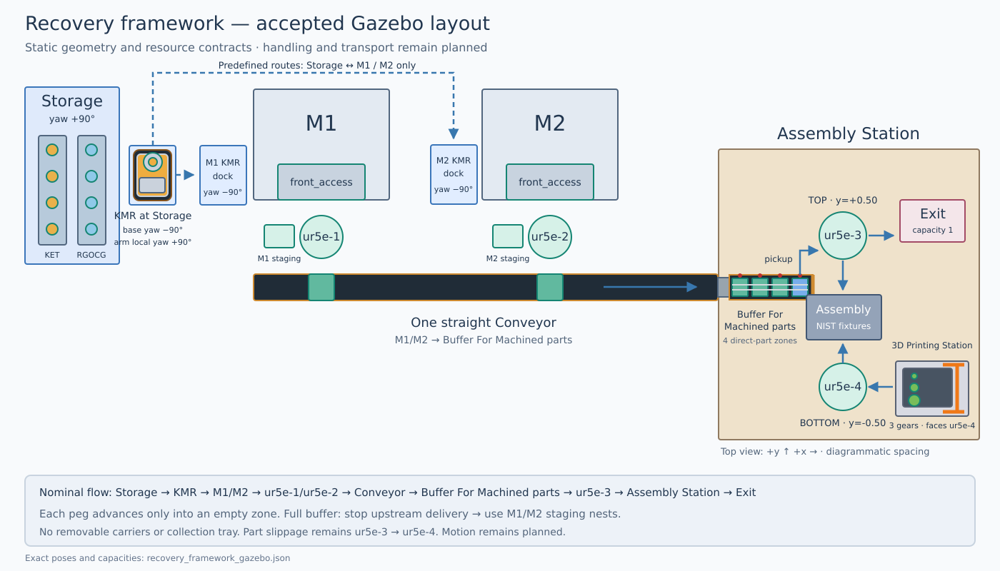

# Recovery framework: M1 and M2 layout

**Current layout: compact M1/M2, 2026-09-21.** The previous 2026-09-16
static layout remains historical evidence in the implementation plan. Storage
pickup and machine reach checks required the docking and stand changes below.

M1 and M2 use a `0.503 × 0.531 × 0.493 m` enclosure, based on the documented
[503 × 531 × 493 mm Bantam Tools Desktop CNC Milling Machine dimensions](https://bantamtools.com/products/bantam-tools-desktop-cnc-milling-machine).
The 1.00 m stand, simplified workholding, spindle, and open `front_access` and
`side_access` are **simulation assumptions**. They are not manufacturer robot
loading features or a validated model of that machine's interior.

The source scene, docking markers, navigation map, and MoveIt collision objects
use this geometry. MoveIt retains separate enclosure panels and the openings;
mesh obstacles use conservative boxes. KMR attachment represents a simulated
fixed-joint grasp, not demonstrated finger contact on the 4 mm peg.

## Resource names and placement

| Resource | Assignment |
| --- | --- |
| `ur5e-1` | M1, M1 staging tray, and its loading position on Conveyor. |
| `ur5e-2` | M2, M2 staging tray, and its loading position on Conveyor. |
| `ur5e-3` | Top of Assembly Station; direct buffer pickup, assembly, and Exit. |
| `ur5e-4` | Bottom of Assembly Station; printer pickup and assembly of its configured printed gears. |
| KMR | KUKA KMR iiwa with detailed KMP omniMove 400 appearance, sideways platform, upright LBR iiwa 14 R820, and open OnRobot RG2, parked on `Storage_KMR_docking_pose`. |

The eighth implementation swaps the assembly robots' placement bindings and
initial configurations together. Prefixes `ur5e_3_` and `ur5e_4_`, controllers,
frames, and MoveIt groups match their resource identifiers. Historical evidence
retains its original names. UR5e task execution remains later work; use the named
RViz groups for their planning checks. KMR delivery bindings are described below.

The tenth implementation keeps the ninth layout and replaces the simplified
KMR platform appearance. The KMP omniMove 400 body remains
`1.08 × 0.63 × 0.70 m`; scanners define the `1.19 × 0.72 × 0.70 m` overall
envelope. The LBR iiwa
base is at local `(-0.25, 0, 0.70)`, with clear deck space on the other side.
The previous correction rotated the platform clockwise 90° in the world and the
complete iiwa, adapter, and RG2 chain counterclockwise 90° around that mount.
The arm therefore keeps its world-facing yaw while the platform and both
machine docking markers stand sideways. The later docking-placement correction
moves the parked KMR to Storage and brings both empty machine markers closer to
their side-access faces.

The compact 2026-09-21 configuration supersedes those historical docking poses:
the platform now uses world yaw `1.57079632679` at Storage, M1, and M2. The local
arm yaw remains `1.57079632679`; the resulting arm orientation supports the
configured Storage grasp and machine approaches. Part slippage remains a future
execution scenario and does not authorize reassignment between `ur5e-3` and
`ur5e-4`.

Storage remains leftmost, followed by M1 and M2 with front openings facing their
own handling robots. KMR access remains through the left-facing `side_access`
openings. One straight Conveyor runs in front of both machine robots and joins
Buffer For Machined parts at Assembly Station. Local staging nests remain
separate from that shared buffer.

## Implemented Gazebo positions

| Element | Position in metres `(x, y, z)` | Meaning |
| --- | --- | --- |
| M1 | `(-6.0, 1.9, 0)` | Machine origin; yaw `-1.57079632679`. |
| M2 | `(-2.6, 1.9, 0)` | Same yaw as M1. |
| `ur5e-1` | `(-6.0, 1.1, 0.80)` | M1 pedestal; yaw `1.57079632679`. |
| `ur5e-2` | `(-2.6, 1.1, 0.80)` | M2 pedestal; same yaw. |
| `ur5e-3` | `(0, 0.50, 1.021)` | Top assembly robot; yaw `3.142`. |
| `ur5e-4` | `(0, -0.50, 1.021)` | Bottom assembly robot; yaw `0`. |
| M1 staging tray | `(-6.55, 1.1, 1.0)` | Capacity-one staging nest. |
| M2 staging tray | `(-3.15, 1.1, 1.0)` | Capacity-one staging nest. |
| Conveyor loading position for `ur5e-1` | `(-6.0, 0.5, 1.015)` | Main belt surface. |
| Conveyor loading position for `ur5e-2` | `(-2.6, 0.5, 1.015)` | Main belt surface. |
| Conveyor output nest | `(-0.78, 0.5, 1.015)` | Capacity-one upstream handoff marker; no blocking end bar. |
| Buffer For Machined parts | `(-0.50, 0.50, 1.015)` | Four direct-part belt zones in `0.48 × 0.24 m`; surface `z=1.017`, capacity four pegs. |
| Buffer pickup | `(-0.32, 0.50, 1.017)` | Downstream pickup for `ur5e-3`. |
| Storage | `(-9.15, 2.3, 0)` | Rotated shelves; yaw `1.57079632679`. |
| `Storage_KMR_docking_pose` | `(-8.24, 2.13, 0)` | East-side dock; base yaw `1.57079632679`, local arm yaw `1.57079632679`. |
| M1 KMR docking pose | `(-6.85, 2.15, 0)` | Side loading; base yaw `1.57079632679`. |
| M2 KMR docking pose | `(-3.45, 2.15, 0)` | Side loading; base yaw `1.57079632679`. |
| `3D Printing Station` | `(0.50, -0.50, 1.04)` | `prusa_mk4_2` beside `ur5e-4`; yaw `-1.57079632679`. |
| `Exit` | `(0.50, 0.58, 1.04)` | Empty capacity-one tray handled by `ur5e-3`. |

M2's east enclosure edge is `x=-2.3345`, and the assembly table's west edge is
`x=-0.75`, leaving a **1.5845 m horizontal gap**. The main Conveyor is **6 m**
long and **0.30 m** wide. This geometry does not establish reachable or
collision-free handling paths.

## Conveyor pickup and backpressure

Buffer For Machined parts has four 120 mm-pitch zones at
`x=-0.68, -0.56, -0.44, -0.32`, all at `y=0.50`, `z=1.017`. Each zone has a
separate belt surface, drive representation, photoeye/reflector pair, and
retracted stop. A 50 mm peg leaves 70 mm nominal separation from the next peg.

The pegs travel directly on the belts with their long axis parallel to the
Conveyor. Two low angled rails form a shallow fixed guide channel with 26 mm
clear width, covering all configured 4–16 mm peg cross-sections. Tapered guides
centre a peg across the 10 mm gap and short inclined plate from Conveyor. The
channel is fixed to the Conveyor; it does not leave with the part. There are no
removable carriers, carrier supply stands, or empty-carrier collection tray.

The future nominal sequence is:

1. `ur5e-1` or `ur5e-2` places a completed peg horizontally on its reserved,
   stopped Conveyor loading position.
2. Conveyor admits it only when buffer zone 1 is empty and reserved.
3. An occupied zone advances only when its downstream zone is empty. Adjacent
   drives synchronize the handoff, then departure and arrival sensors confirm
   it. The next peg never pushes the preceding peg.
4. Zone 4 stops and locates the peg; `ur5e-3` picks it directly into assembly
   with one grasp.
5. Confirmed pickup, a clear zone 4 sensor, and robot withdrawal allow the next
   zone to advance.
6. A full buffer stops upstream delivery; machine robots use their staging
   nests. Missing or conflicting sensor feedback stops the affected zones and
   preserves the last confirmed part custody.

This follows zero-pressure accumulation: independent zones use detection and
control to avoid parts contacting one another. The current world shows the
physical concept only. The buffer starts empty, and all belt, guide, sensor,
and stop geometry is static. Transport, feedback, reservations, custody
transfer, stop actuation, horizontal loading, and pickup stability still
require implementation and live validation.

## Storage, printer, and Exit

The four exact KET models remain in Storage's upper kitting tray and the four
exact RGOCG models in its middle tray. Their rotated poses, CAD meshes, and
individual pickability are preserved. No loose pegs start at Assembly Station.

The printer's open front faces `ur5e-4`, with all three exact gears on its bed:

| Product | Center pose `(x, y, z)`; yaw `0` |
| --- | --- |
| `gear_small` | `(0.44, -0.58, 1.11)` |
| `gear_medium` | `(0.44, -0.50, 1.11)` |
| `gear_large` | `(0.44, -0.42, 1.11)` |

`initial_products` and `output_poses` record this inventory. The gear centers
sit 10 mm above the bed surface, so their collision geometry rests on it.
`cam_mk4_2` moves to `(0.50, -0.50, 1.75)` looking downward. The printer is
0.50 m horizontally from `ur5e-4`; gear centers are approximately 0.44–0.45 m
away. These are placement distances, not motion reach validation. The active
order and dedicated Spec2Primitives world are unchanged.

Exit's contract assigns `ur5e-3` to transfer completed `assembly_board-v1` to
`(0.50, 0.58, 1.075)`. `GMC_Laser_Plate_Virtual` and `Gear_Plate` remain static
tooling; detachable assemblies and Exit execution remain later work.

## KMR: predefined model and recovery

KMR starts at `(-8.24, 2.13, 0)` on `Storage_KMR_docking_pose`, with platform
yaw `1.57079632679` and upright arm configuration
`[0, 0, 0, 0, 0, 0, 0]`. Its KMP omniMove 400 appearance includes four 250 mm
Mecanum wheels, front and rear safety scanners, eight ultrasonic sensors, RGB
bands, and two emergency stops. The iiwa links, nominal 20 mm adapter, and open
RG2 share the arm mount `(-0.25, 0, 0.70)` and local yaw
`1.57079632679`. The arm root is therefore at world
`(-8.24, 1.88, 0.70)`. `mount_verified: false` remains until
the arm and adapter transforms are measured on the lab hardware. Meshes,
licenses, KMR poses, and Storage–M1/M2 route contracts remain.

The source world retains this static `KMR` as the accepted layout reference.
During the recovery launch, a temporary runtime-world copy omits that include
and spawns exactly one articulated `KMR` at the same pose. The simulated KMP
omniMove 400 publishes `/KMR/odom` and accepts `/KMR/cmd_vel`; the seven LBR
iiwa joints and `KMR_rg2_finger_width` have separate trajectory controllers.
`/KMR/dock` follows only the reversible Storage–M1 and Storage–M2 waypoint
routes. Direct named M1-to-M2 docking remains rejected. Collision-aware free
base goals are available through the RViz **Nav2 Goal** arrow and the blue
`KMR_base` marker, but reaching a nearby pose does not establish semantic
docking or machine readiness. The delivery integration binds KMR, Storage, and M1 resource contexts for the
explicit Storage-to-M1 order. Other task execution remains outside this increment.

The RViz planning model previews KMR at its configured
`Storage_KMR_docking_pose` before Gazebo odometry starts. This removes the
temporary world-origin display during startup. The preview is visualization
state only: the docking action and actionable base marker remain gated on fresh
`/KMR/odom`. RViz opens after all live joint state and KMR odometry are
available, so its five orange MoveIt goal models start at the current robot
poses. Drag and rotate the blue `KMR_base` marker to stage an arbitrary Nav2
target; dragging alone does not move the base. Its menu provides plan, execute,
plan and execute, reset, **Dock at Storage**, **Dock at M1**, **Dock at M2**,
and cancellation. Named docking follows the fixed Storage–M1/M2 waypoints with
a deterministic yaw-holding holonomic controller. Nav2 remains responsible for
freely staged targets and reaching the Storage approach from an arbitrary pose.
The RViz **Nav2 Goal** arrow plans and executes immediately through
`/KMR/validated_navigate_to_pose`; the blue marker retains separate Plan and
Execute review through `/KMR/validated_follow_path`. Both require fresh
odometry, a parked iiwa, available Nav2, and an unused base-action slot.

## Recovery experiments

1. **Conveyor breakdown:** `ur5e-1` stages the completed part. Recovery proposes
   and validates KMR collection and delivery to Buffer For Machined parts;
   that route is absent from the predefined model.
2. **Machining station handling robot breakdown (`ur5e-1`):** recovery proposes
   KMR unloading M1 through `side_access`, then a new route and loading pose
   for Conveyor. Keep the failed robot at its actual failure pose. Blocked
   access or an invalid loading motion makes this recovery infeasible.
3. **Machining breakdown during part processing:** `ur5e-1` or KMR extracts
   recoverable WIP from M1. Recovery validates transport and staging at M2;
   `ur5e-2` loads M2 for the remaining operations after any required configuration
   change. Nominal access to M1/M2 does not establish WIP handling capability.
4. **Part slippage:** `ur5e-3` loses a part into `ur5e-4`'s region. `ur5e-4`
   stages its current part, completes the interrupted task with the recovered
   part, and resumes its original sequence.

Both machine openings access the same `workholding` location. Require exclusive
access and preserve part identity, custody, and WIP progress. These sequences
are hypotheses, not compulsory responses to failure names.

## Layout completion boundary and next project work

This document describes the current compact layout; previous dated results remain historical. The known NIST Products
increment now binds all three gears and eight pegs to explicit CAD filenames,
Gazebo models, source resources, and assembly targets. Recovery orders may save
and reload any valid subset of those eleven exact identifiers.

The current workholding targets are `(-6.08, 1.82, 1.06)` for M1 and
`(-2.68, 1.82, 1.06)` for M2, each with yaw `-1.57079632679`.
The [current geometry checks](../../cais_spade_llm/monitor/recovery_gazebo_runs/20260921T200209_5d5b706e/machine_paths.json)
passed collision-aware IK and Cartesian approaches with fraction `1.0` for
KMR at M1/M2, `ur5e-1` at M1, and `ur5e-2` at M2. These are planning results;
no UR5e handling was executed. Storage pickup uses a configured tilted grasp,
lift, withdrawal, and parked transport pose.

The [completed Gazebo transfer](../../cais_spade_llm/monitor/recovery_gazebo_runs/20260921T194635_5b778116/run.json)
records Storage pickup, loaded transport, M1 release, and withdrawal. It used
the earlier 0.98 m stand; the current 1.00 m stand closes its 0.02 m gap.
The later reach checks and [active Stop test](../../cais_spade_llm/monitor/recovery_gazebo_runs/20260921T200209_5d5b706e/control_verification.json)
use the corrected stand. These results do not establish physical grasp contact
or hardware validation.

The remaining work is machine → staging → Conveyor handling, `ur5e-3` buffer
pickup and Exit, `ur5e-4` printer pickup, Conveyor/buffer actuation and sensing,
machining/printing, detachable assemblies, and recovery. See the implementation
plan for the separately recorded KMR delivery acceptance result.

Timed execution must record machining completion, Conveyor arrival, buffer
zone advancement, robot pickup, assembly completion, queue occupancy, and resource
blocking before making throughput claims. Perception remains disabled pending
recovery-specific calibration. See [IMPLEMENTATION_PLAN.md](IMPLEMENTATION_PLAN.md)
for verification evidence.
